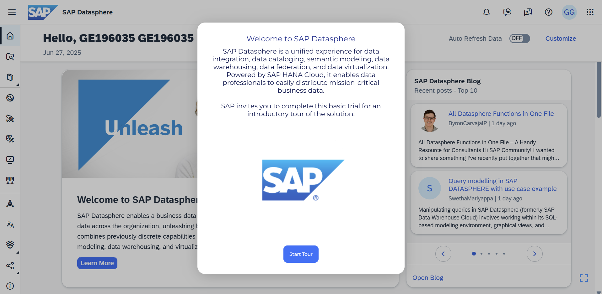

# Guided Tours 탐색

> **원본 레슨**: guided-tours | **소요시간**: 15분

## 학습 목표
가이드 투어를 탐색합니다.

## 주요 내용

### SAP Datasphere Overview 가이드 투어
SAP Datasphere의 기능과 특징을 단계별 가상 워크스루(Virtual Walkthrough)를 통해 살펴봅니다.

가이드 투어를 통해 다음을 수행합니다:
- SAP Datasphere 플랫폼의 다양한 페이지와 컴포넌트를 탐색하여 레이아웃과 기능을 이해합니다.
- 투어 링크에 접근하여 SAP Datasphere 내의 단계를 따라 진행합니다.

## 핵심 포인트
- 가이드 투어는 SAP Datasphere의 전체 기능을 빠르게 파악하는 데 유용합니다.
- 단계별로 구성된 가상 워크스루로 실제 시스템 환경을 미리 체험할 수 있습니다.
- 투어 완료 후 다음 단원(Getting started with SAP Datasphere)으로 진행합니다.
