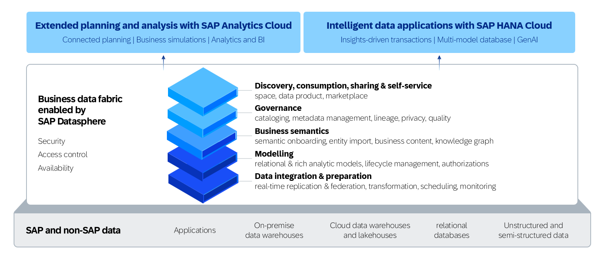
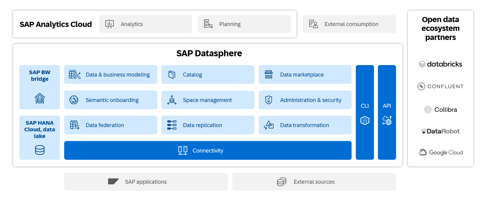
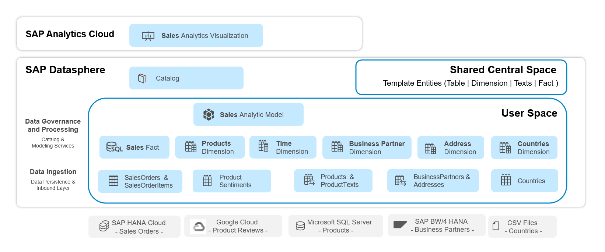

# SAP Datasphere 소개 (Introduction)

> **원본 레슨**: dsp-overview-intro | **소요시간**: 4분

## 학습 목표
SAP Datasphere와 워크북 시나리오를 소개합니다. 데이터 및 비즈니스 오브젝트의 아키텍처 개요와 각 단원에서 다루는 주요 기능을 이해합니다.

## 주요 내용

### SAP Datasphere란?
SAP Datasphere는 모든 데이터에 걸쳐 **데이터 통합**, **카탈로그화**, **시맨틱 모델링**, **데이터 웨어하우스**, **워크로드 가상화**를 하나로 제공하는 통합 서비스입니다.

비즈니스 데이터 패브릭(Business Data Fabric) 아키텍처를 구현하여, 비즈니스 컨텍스트와 로직을 그대로 유지한 채 모든 데이터 소비자에게 의미 있는 데이터를 제공할 수 있도록 도와줍니다. 셀프서비스 데이터 접근, 데이터 검색, 오케스트레이션, 처리 및 영속성, 데이터 거버넌스, 데이터 수집 등의 핵심 구성 요소를 제공합니다.

### 워크샵 시나리오 개요
**SAP Datasphere Overview**는 데이터 수집(ingest), 처리(process), 시각화(visualize)를 위한 도구 세트에 대한 통찰을 제공합니다. SAP Business Content나 Data Marketplace의 데이터를 활용하면 데이터 패브릭 아키텍처 구축을 가속화할 수 있습니다.

이 워크샵은 **Data Ingestion**, **Data Governance**, **Processing**에 중점을 둡니다. 자전거 판매 샘플 콘텐츠(Bikes Sales Sample Content)를 기반으로, 다차원적이고 시맨틱이 풍부한 분석 모델링을 가능하게 하는 분석 모델의 기반이 되는 데이터 모델을 정의합니다.

- 여러 SAP 및 비SAP 소스 시스템에서 데이터를 수집 (페더레이션 및 복제 플로우 방식 활용)
- 수집된 데이터셋을 기반으로 계층 구조를 포함한 차원(Dimension) 및 팩트 뷰(Fact View) 구성
- **Analytic Model**에서 분석 사용자가 데이터를 보는 방식을 설계하고 제한/예외 집계 기반 신규 계산 정의
- **SAP Analytics Cloud**에서 분석 정보 확인
- **SAP Datasphere Catalog** 탐색: 비즈니스 데이터가 어떻게 구성·분류되는지, 어떤 메타데이터/용어/KPI가 제공되는지 확인

### 데이터 엔티티 관점 (Data Entity Perspective)

데이터 오브젝트는 SAP Datasphere 스페이스(Space) 안에 생성됩니다. 각 사용자는 모델링을 위한 개인 스페이스를 가지며, 테이블·차원·팩트 오브젝트로 구성된 사전 정의된 데이터셋이 중앙 스페이스 **CENTRAL_DATA**에 저장되어 각 사용자 스페이스에 공유됩니다.

**계층 구조:**
- **최하위 레이어**: SAP HANA Cloud 등 소스 시스템과 그 오브젝트
- **데이터 수집 레이어**: SAP HANA Cloud에서 복제된 판매 주문(Sales Orders), 판매 주문 항목(Sales Order Items) 테이블 등
- **모델링 레이어**: 테이블 또는 관계형 데이터셋 기반의 엔티티 생성
  - **Fact**: 하나 이상의 측정값(Measure)과 속성(Attribute)을 포함. 일반적으로 하나 이상의 차원을 연결하는 연관(Association)을 가짐
  - **Dimension**: 제품 목록이나 비즈니스 파트너 정보 같은 마스터 데이터 속성과 계층 구조 포함
- **분석 모델 레이어**: 판매 분석 모델(Sales Analytic Model)이 연결된 차원과 함께 Sales Fact 엔티티를 기반으로 구성됨

## 핵심 포인트
- 여러 방법을 사용한 데이터 수집 방법 이해
- 페더레이션 및 복제 데이터셋을 결합한 데이터 모델 구축
- 팩트 및 차원 뷰 기반 분석 모델 생성
- SAP Datasphere 내에서 분석 보고서 미리보기
- 분석 모델 기반의 SAP Analytics Cloud BI 보고서 생성
- SAP Datasphere Catalog 탐색

## 모듈식 접근 방식
각 단원은 순서대로 또는 개별적으로 완료할 수 있습니다:
1. **Data Acquisition** (데이터 수집)
2. **Data Modeling** (데이터 모델링)
3. **Analytic Modeling** (분석 모델링)
4. **SAP Analytics Cloud Visualization** (SAC 시각화)
5. **Explore the Catalog** (카탈로그 탐색)

## 사전 요건 (Prerequisites)
1. 로그온 정보 및 자격증명을 보유해야 합니다.
2. 각 사용자는 사전 정의된 시스템 연결, 공유 오브젝트, 생성된 시간 데이터가 포함된 개인 SAP Datasphere 스페이스에 접근할 수 있습니다.
3. **Google Chrome 브라우저의 시크릿 모드(incognito mode)** 사용을 권장합니다.
