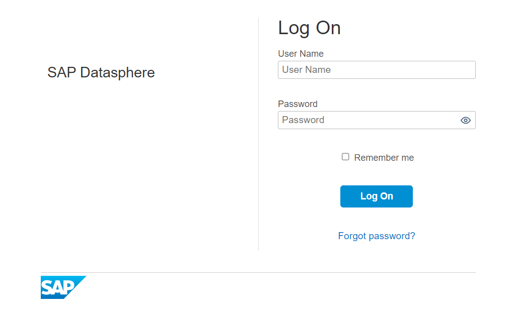
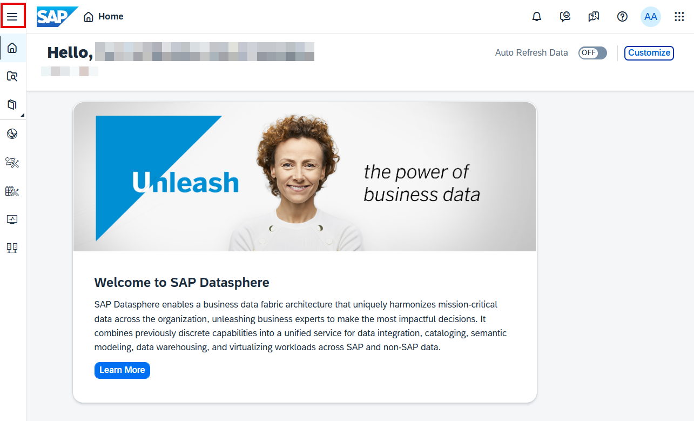
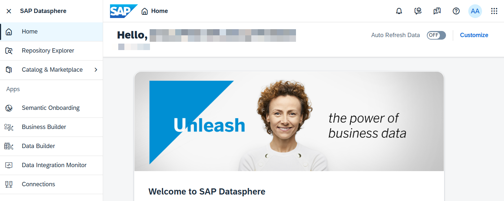
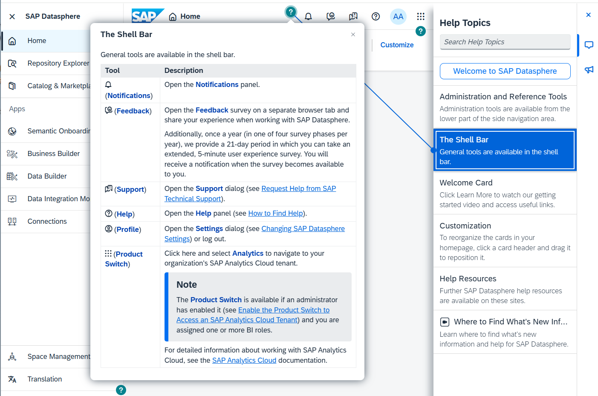
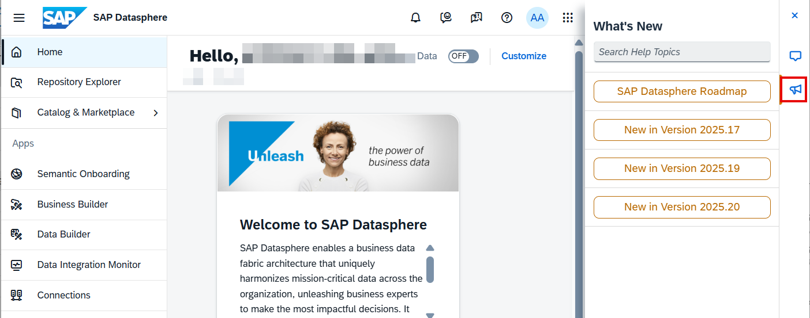
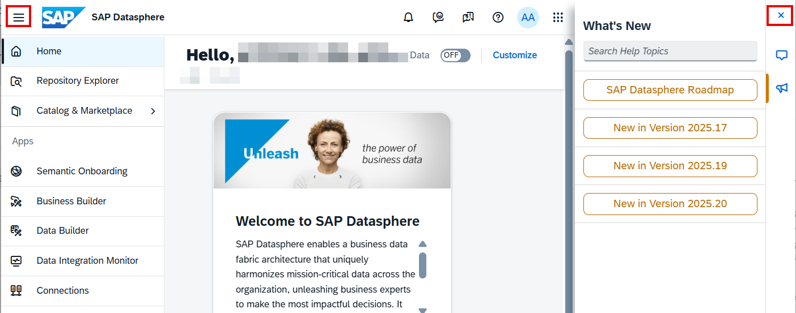

# SAP Datasphere 로그온

> **원본 레슨**: dsp-overview-logon | **소요시간**: 2분

## 학습 목표
SAP Datasphere 테넌트에 접속하고, 첫 화면을 탐색하며 인앱 도움말을 활용합니다.

## 주요 내용

### 로그온 절차

1. **Chrome 브라우저**를 열고, 워크샵 주관자에게 받은 SAP Datasphere URL을 입력합니다.
2. 제공받은 사용자 자격증명으로 로그인합니다.
   - Username: 제공받은 사용자 ID
   - Password: 제공받은 비밀번호
   
   > **참고**: 로그인 문제가 발생할 경우 Chrome 브라우저 캐시(CTL+H)를 삭제하거나 시크릿 창(Incognito Window)을 사용하여 올바른 자격증명으로 로그인하세요.

3. **SAP Datasphere 홈 페이지**에서 최근 오브젝트, 빠른 액션, 블로그 게시물 등을 확인합니다. 카드를 표시/숨기기/순서 변경할 수 있습니다.

4. 왼쪽 상단 모서리의 사이드 내비게이션을 **확장(Expand)**하면 SAP Datasphere에서 사용 가능한 앱 전체 목록을 볼 수 있습니다.

5. 오른쪽 상단의 물음표 아이콘 **"?"** 를 선택하면 인앱 도움말이 열립니다. 열려 있는 앱에 따라 오른쪽 **Help Topics** 패널에 관련 도움말 정보가 표시됩니다.

6. **What's New** 메가폰 아이콘을 선택하면 최근 릴리스된 기능 정보 링크가 표시됩니다. 버전 링크를 선택하면 새 브라우저 탭에서 열립니다.

7. 오른쪽 상단의 닫기 아이콘 **'X'** 를 선택하여 인앱 도움말 패널을 닫습니다.

8. 왼쪽 상단 사이드 내비게이션을 **축소(Collapse)**하여 세부 내용을 다시 숨깁니다.

축하합니다! SAP Datasphere에 성공적으로 로그온했습니다.

## 핵심 포인트
- SAP Datasphere 접속 시 **Google Chrome** 브라우저 사용 권장
- 로그인 문제 발생 시 브라우저 캐시 삭제 또는 시크릿 모드 사용
- 홈 페이지에서 카드 레이아웃을 개인 맞춤 설정 가능
- **"?"** 아이콘으로 컨텍스트 기반 도움말 즉시 접근 가능
- **What's New** 패널에서 최신 기능 확인 가능
