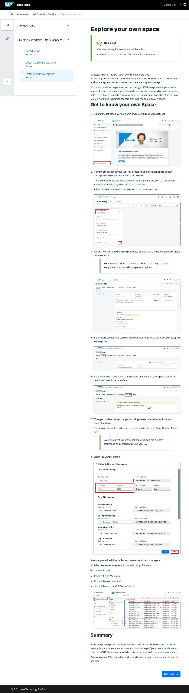

# 나만의 스페이스 탐색

> **원본 레슨**: dsp-overview-space | **소요시간**: 4분

## 학습 목표
SAP Datasphere 사용자 스페이스에 접근하고 탐색합니다.

## 주요 내용

### 스페이스(Space)란?
스페이스는 SAP Datasphere에서 팀/프로젝트/부서 단위의 가상 환경입니다. 관리자가 사용자를 할당하고, 소스 시스템 연결을 추가하며, 메모리와 스토리지를 배분합니다.

모든 데이터 수집, 준비, 모델링은 스페이스 내부에서 이루어지며, 스페이스 데이터는 다른 스페이스에 공유되거나 소비(Consumption)용으로 공개되지 않는 한 외부에서 접근할 수 없습니다.

### 스페이스 탐색 단계

1. 왼쪽 사이드 내비게이션을 확장하고 **Space Management**를 선택합니다.
2. 내 사용자가 접근 가능한 스페이스 목록을 확인합니다. 할당된 스페이스 이름은 일반적으로 사용자 ID와 동일합니다.
3. 스페이스 개요에서 스토리지 용량, 할당된 사용자 수, 소스 연결, 오브젝트 정보를 확인합니다.
4. 할당된 스페이스의 **Edit** 버튼을 선택합니다. 스페이스 속성 및 일부 설정을 확인할 수 있습니다.
   > **참고**: 스토리지 할당 및 워크로드 관리 옵션은 변경 권한이 없습니다.
5. **Users** 섹션에서 내 사용자 ID가 스페이스에 이미 할당되어 있는지 확인합니다.
6. **Time Data** 섹션에서 스페이스의 시간 데이터를 생성할 수 있습니다. 연도 범위를 업데이트하면 시간 테이블과 차원 뷰가 생성됩니다 (Year, Quarter, Month, Day 계층 구조 활용 가능).
   > **참고**: 이 워크북에서는 해당 오브젝트가 이미 사전 정의되어 공유된 상태입니다.
7. **Cancel** 버튼을 선택합니다.
8. 사이드 내비게이션에서 **Repository Explorer**를 선택하고, 다음 사전 정의된 오브젝트를 확인합니다:
   - Dimension 타입 뷰 4개
   - Text 타입 로컬 테이블 3개
   - Relational Dataset 타입 로컬 테이블 1개

## 핵심 포인트
- SAP Datasphere의 모든 데이터 워크플로우는 스페이스 선택에서 시작됨
- 스페이스는 보안 영역으로, 명시적으로 공유하지 않는 한 외부 접근 불가
- 사전 정의된 시간 데이터 테이블과 차원 뷰가 스페이스에 공유되어 있음
- **Repository Explorer**에서 스페이스 내 오브젝트 확인 가능

