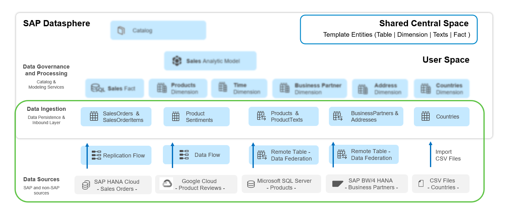

# 데이터 수집 소개 (Data Acquisition Introduction)

> **원본 레슨**: dsp-overview-acquistion-intro | **소요시간**: 3분

## 학습 목표
SAP 및 비SAP 소스에서 데이터를 가져오는 데이터 수집, 접근 유형 및 방법을 이해합니다. 아키텍처 개요를 통해 이 단원에서 처리되는 데이터 소스, 수집 방법, 데이터 인바운드 레이어 대상 오브젝트를 파악합니다.

## 주요 내용

### SAP Datasphere 데이터 접근 방식
SAP Datasphere를 통해 어디서든 데이터를 가상으로 접근하거나 물리적으로 저장할 수 있습니다:
- **가상화(Virtualization)**: 다양한 소스 시스템에 대한 실시간 페더레이션 접근. 데이터는 소스에 그대로 두고 필요 시에만 원격 접근 (하이퍼스케일러 포함)
- **복제(Replication)**: 대용량 데이터 또는 접근 속도가 느린 소스의 데이터를 실시간 또는 예약 방식으로 전송하여 고속 접근 실현
- 페더레이션 데이터에서 영속 데이터로 **클릭 한 번**으로 전환 가능

### 데이터 수집 단원의 핵심 내용
- 소스 연결 유효성 검사
- 데이터 수집 방법
- 페더레이션 데이터에서 영속 데이터로 전환
- 테이블 시맨틱(Semantics) 조정

### 데이터 소스
| 소스 | 데이터 |
|------|--------|
| SAP HANA Cloud | 판매 주문(Sales Order), 판매 주문 항목(Sales Order Items) |
| Google Cloud | 제품 리뷰(Product Reviews) |
| Microsoft SQL Server | 비즈니스 파트너(Business Partners), 주소(Addresses) |
| SAP BW/4HANA | 제품(Products), 제품 텍스트(Product Texts) |
| CSV 파일 | 국가(Countries), 국가 텍스트(Country Text) |

### 데이터 수집 방법
- **Replication Flow**: 데이터 영속화
- **Data Flow**: 데이터 영속화
- **Remote Table Access**: 페더레이션 데이터
- **CSV Files Import**: 데이터 업로드

### SAP Datasphere 수집 대상 오브젝트
- SalesOrder, SalesOrderItems 테이블
- ProductSentiments 테이블
- BusinessPartners, Addresses 원격 테이블
- Products, Product Texts 원격 테이블
- Countries, CountryTexts 테이블 (Dimension 및 Texts 타입)

### [선택] 모듈식 접근
중앙 공유 스페이스 **CENTRAL_DATA**에 워크샵 데이터셋이 사전 정의·저장되어 있으며, 사용자 스페이스에 공유됩니다. 이를 통해 이 단원의 전체 또는 일부 레슨만 선택적으로 수행할 수 있습니다.

## 핵심 포인트
- SAP Datasphere는 SAP/비SAP 소스의 데이터를 가상 또는 물리적으로 접근·저장 가능
- 페더레이션과 복제 방식을 비즈니스 요건에 따라 선택하거나 혼합 사용 가능
- 클릭 한 번으로 페더레이션 ↔ 영속 데이터 전환 가능

## 화면 스크린샷

