# Replication Flow 정의

> **원본 레슨**: dsp-overview-replication-flow | **소요시간**: 10분

## 학습 목표
판매 주문 데이터를 읽기 위한 Replication Flow를 생성합니다.

## 주요 내용

### 개요
SAP HANA Cloud에 저장된 판매 주문(Sales Orders) 및 판매 주문 항목(Sales Order Items) 두 테이블을 가져옵니다. Replication Flow를 생성하여 외부 소스의 테이블 구조와 데이터를 사용자 스페이스로 복사합니다.

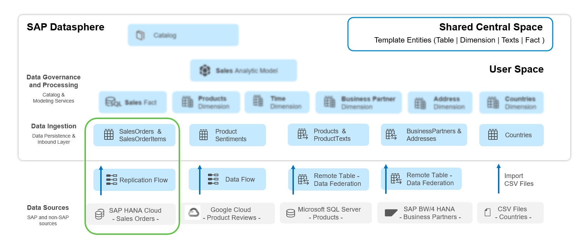

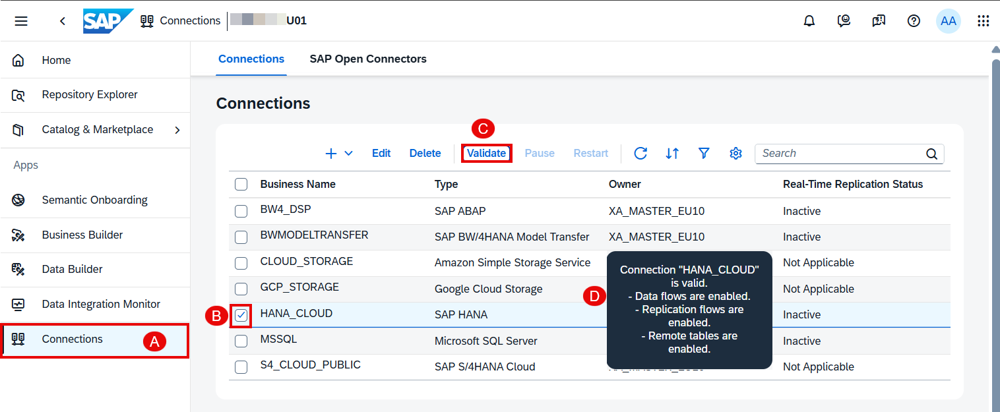

### 1단계: HANA Cloud 소스 연결 확인
1. 사이드 내비게이션에서 **Connections**를 선택하고 스페이스를 선택합니다.
2. SAP 및 비SAP 소스에 대한 연결 목록이 표시됩니다.
3. **HANA_CLOUD** 연결을 선택하고 **Validate**를 클릭합니다.
4. 연결 가용성 및 지원 기능에 대한 메시지가 표시됩니다.

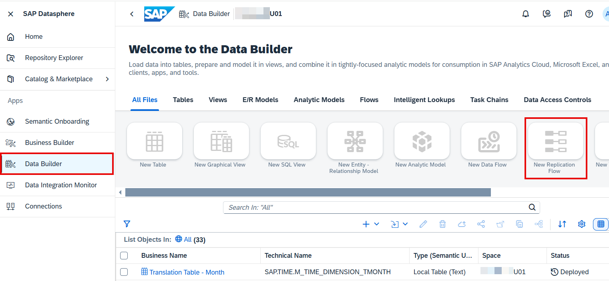

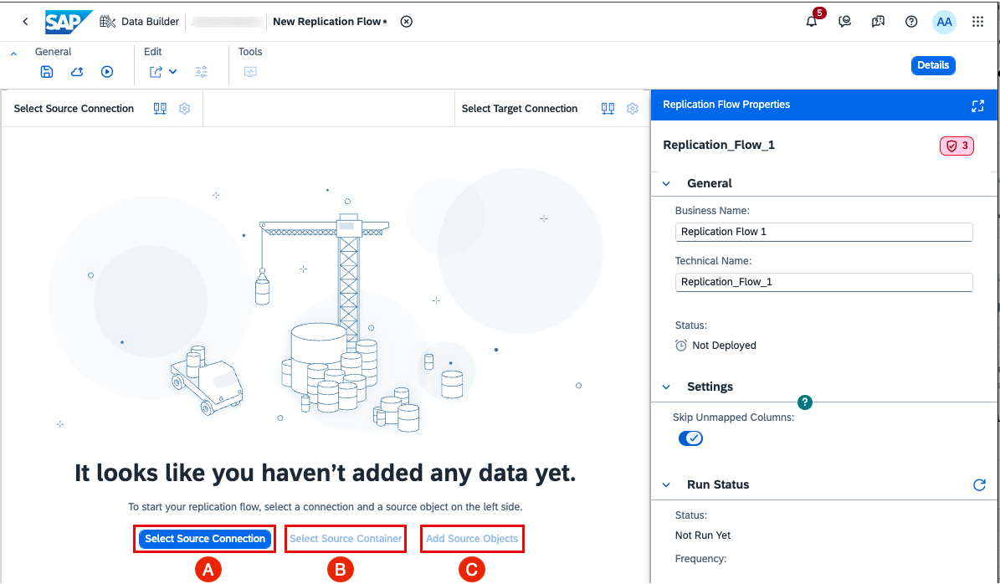

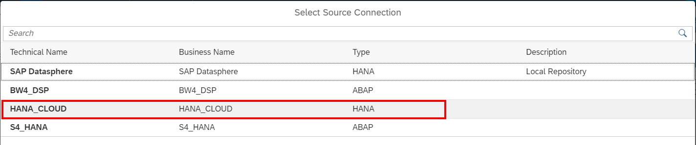

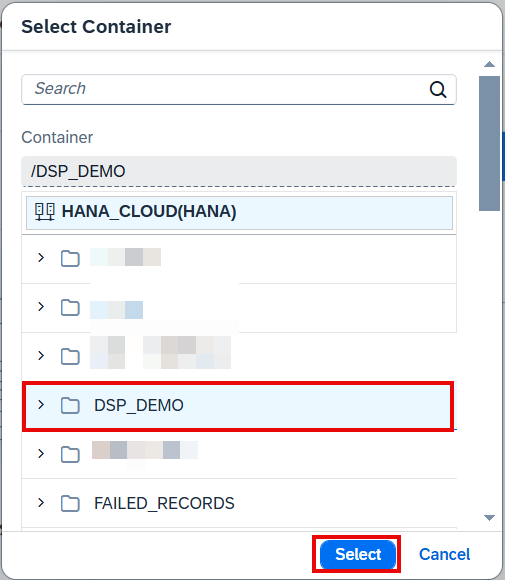

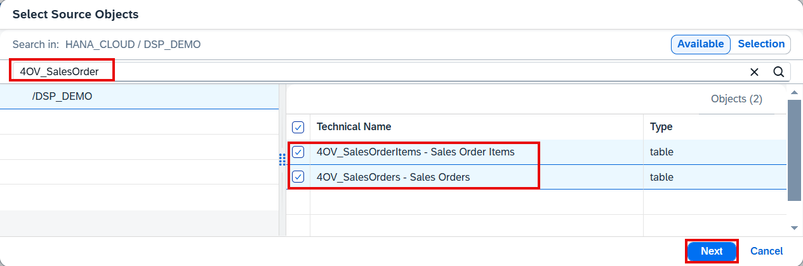

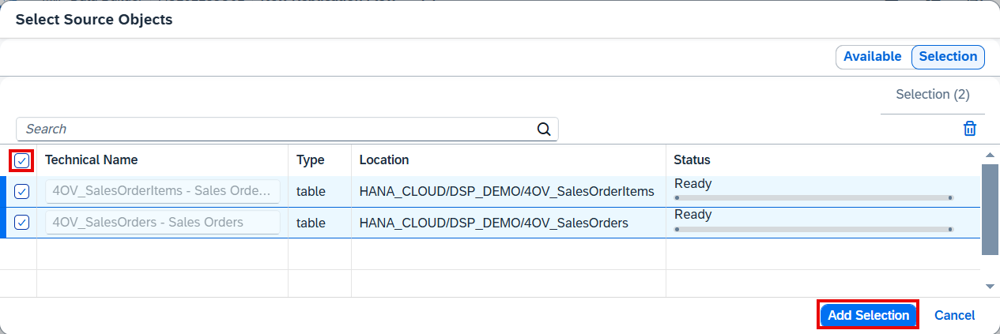

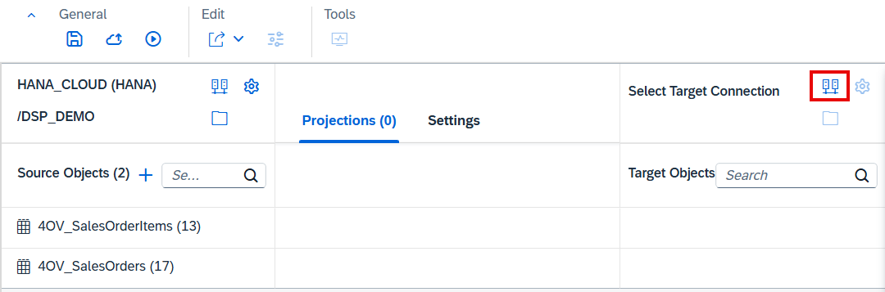

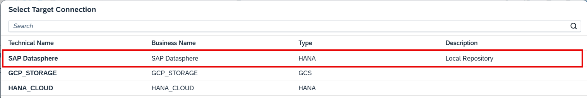

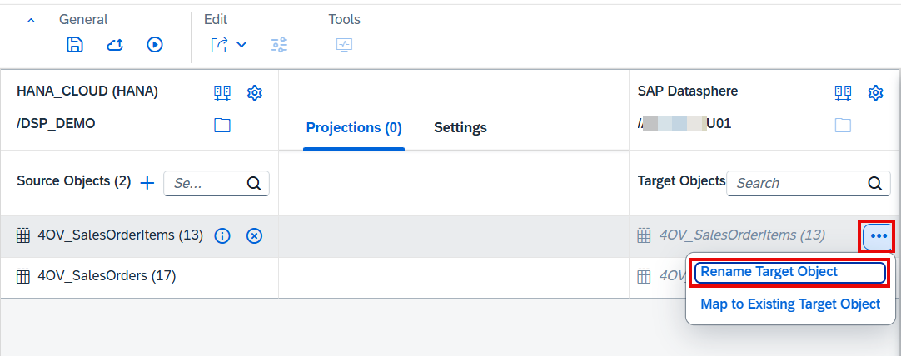

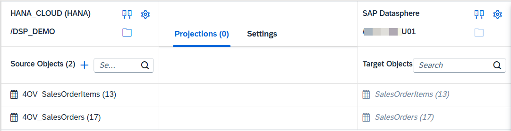

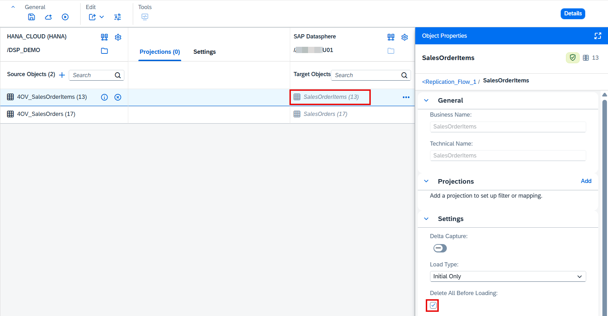

### 2단계: Replication Flow 생성
Replication Flow는 하나의 소스에서 단일 타겟으로 여러 데이터 자산을 빠르고 쉽게 로드하는 기능입니다. SAP HANA, SAP HANA Cloud, SAP S/4HANA 등 다양한 소스를 지원합니다.

1. 사이드 내비게이션에서 **Data Builder**를 선택합니다.
2. 스페이스를 선택합니다.
3. **New Replication Flow** 타일을 선택하여 편집기를 엽니다.
4. 오른쪽 속성 패널이 열립니다. 소스 또는 타겟 오브젝트 선택 시 패널 내용이 변경됩니다.

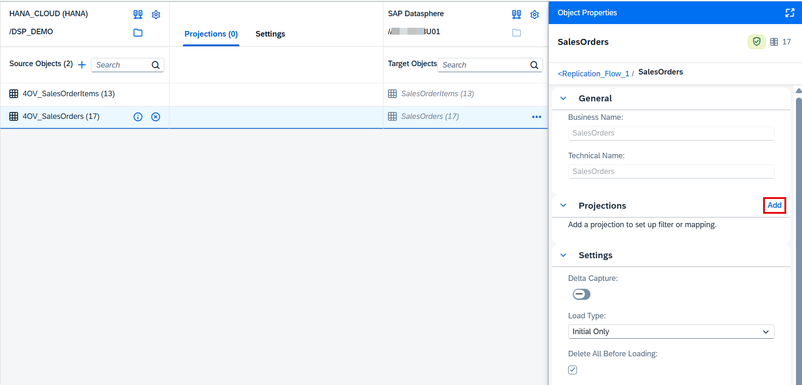

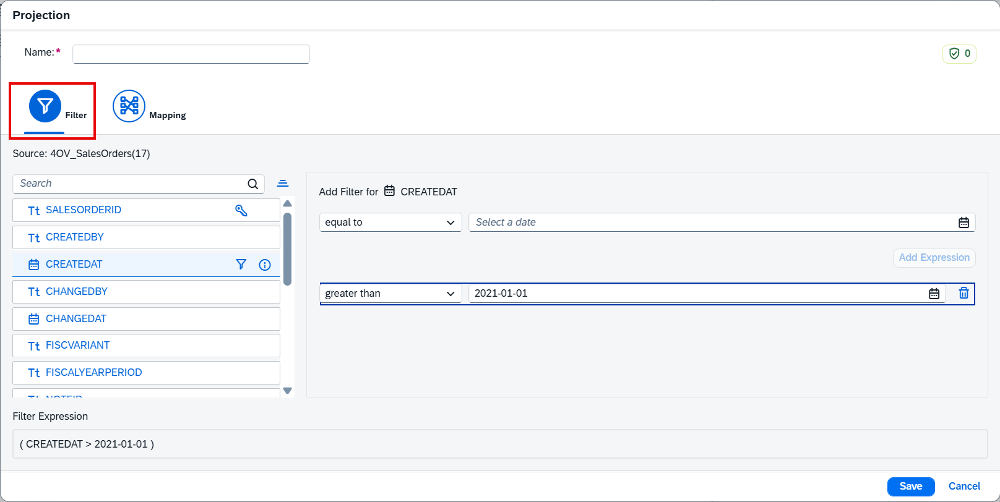

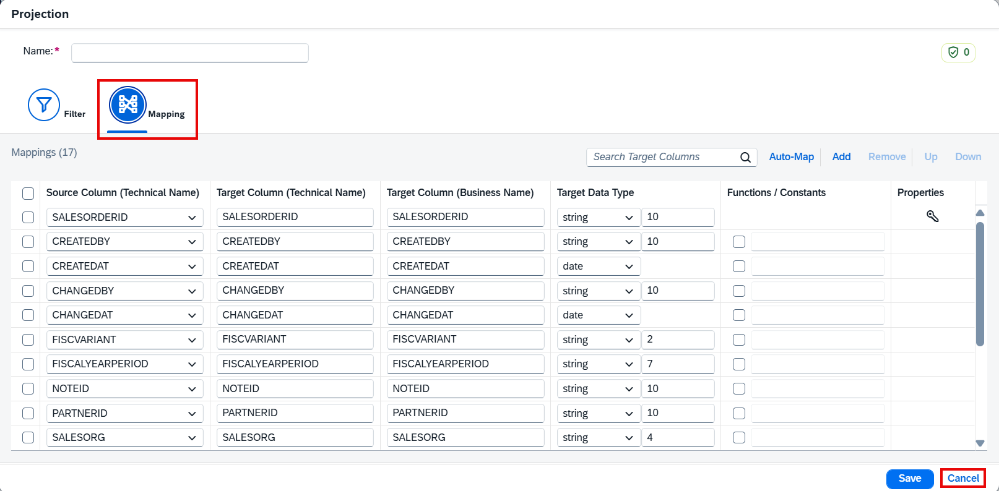

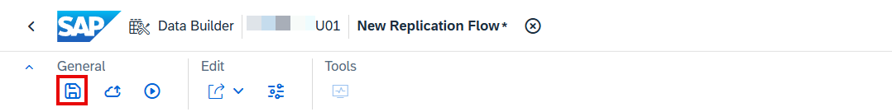

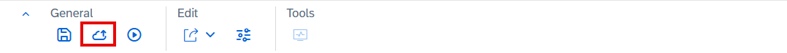

### 3단계: 소스 오브젝트 선택
1. **Select Source Connection**을 선택합니다.
2. 목록에서 **HANA_CLOUD**를 선택합니다.
3. 소스 컨테이너(스키마/패키지)를 선택합니다.
4. SalesOrder, SalesOrderItems 오브젝트를 선택하여 추가합니다.

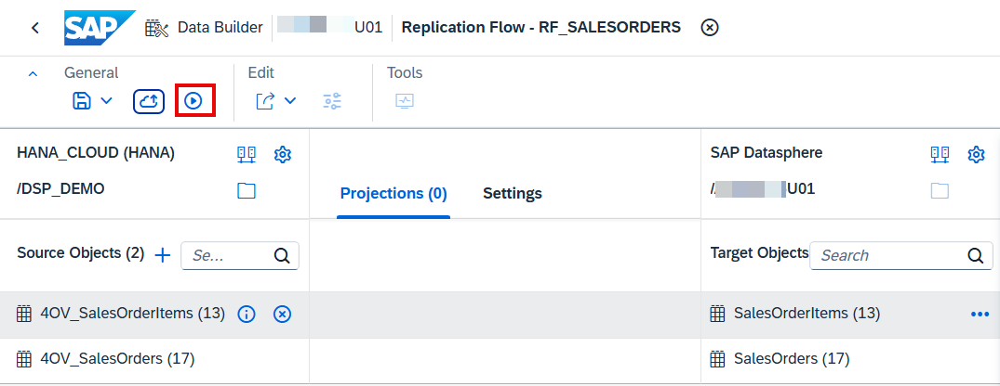

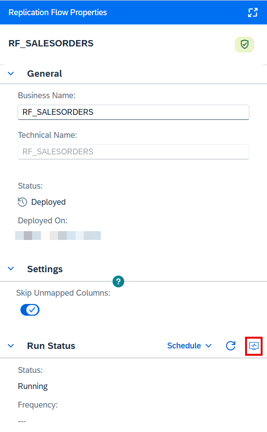

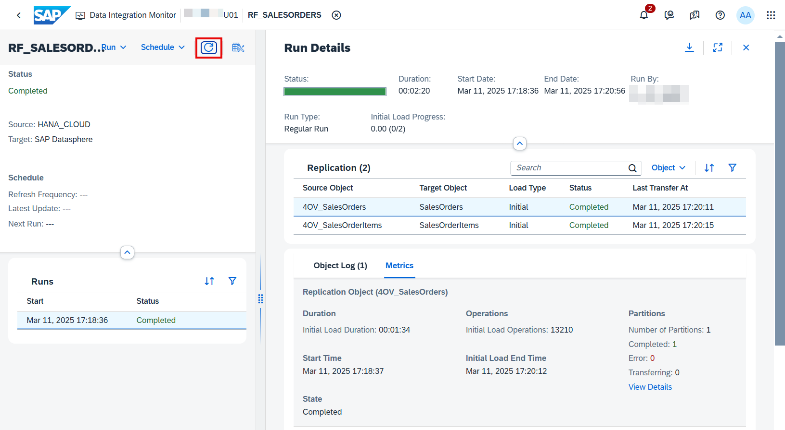

### 4단계: 타겟 오브젝트 정의
1. 타겟 연결과 컨테이너를 선택하고 파라미터를 설정합니다.
2. 두 소스 테이블이 Replication Flow 편집기에서 타겟 오브젝트에 자동 매핑됩니다.
3. 타겟 오브젝트명에서 '04V\_' 접두사를 제거하여 이름을 변경합니다.
4. 타겟 오브젝트 속성에서 복제 동작을 설정합니다: **Initial Load Only** 선택, 두 타겟 테이블 모두 **Truncate** 옵션 활성화.

### 5단계: Replication Flow 배포 및 실행
1. 기본 매핑 및 필터 설정을 확인합니다.
2. Replication Flow를 **저장(Save)**하고 **배포(Deploy)**합니다.
3. **Run** 버튼을 클릭하여 복제를 시작합니다.

### 6단계: 복제 작업 모니터링
- **Data Integration Monitor**에서 복제 작업 상태를 확인합니다.
- 복제 완료 후 타겟 테이블에 데이터가 적재되었는지 검증합니다.
- **Data Preview** 기능으로 복제된 데이터를 미리 볼 수 있습니다.

## 핵심 포인트
- Replication Flow는 여러 테이블을 소스에서 타겟으로 한 번에 복제 가능
- **Initial Load** 후 실시간 또는 스케줄 방식의 델타 복제 지원
- 타겟 오브젝트에서 필터 및 매핑 세부 설정 가능
- **Data Integration Monitor**에서 복제 작업 모니터링
