# Data Flow 생성

> **원본 레슨**: dsp-overview-data-flow | **소요시간**: 10분

## 학습 목표
Google Cloud Storage에서 제품 감성 데이터를 읽는 Data Flow를 생성합니다.

## 주요 내용

### 개요
Google 파일 스토리지에 저장된 데이터를 Data Flow를 통해 로드합니다. 이 데이터는 제품에 감성 점수(Sentiment Score)를 부여하는 데 사용되며, 소셜 미디어 등 외부 소스의 제품 리뷰 데이터를 SAP Datasphere에 통합하는 방법을 보여줍니다.

Data Flow는 데이터를 저장하기 전에 여러 변환을 수행해야 하는 경우에 사용합니다. 이 레슨에서 로드한 데이터는 이후 모델링 레슨에서 **Product Dimension** 오브젝트와 조인됩니다.

### 1단계: Google Cloud Storage 소스 연결 확인
> **참고**: 환경에 Google Cloud Storage(GCS) 연결이 이미 설정되어 있으므로 연결 속성만 확인합니다.

1. 사이드 내비게이션에서 **Connections**를 선택합니다.
2. **GCP_STORAGE** 연결을 선택하고 **Edit**을 클릭합니다.
3. Google Cloud Storage 연결에는 다음 정보가 포함됩니다: Business Name, Technical Name, Project, Root Path, Key(JSON 형식)

### 2단계: Data Flow 생성
1. **Data Builder**를 선택합니다.
2. **New Data Flow** 타일을 선택하여 편집기를 엽니다.
3. 소스로 **GCP_STORAGE**를 선택하고 파일 경로를 지정합니다.

### 3단계: Python 스크립트 추가
Data Flow에 Python 스크립트 노드를 추가하여 데이터를 변환합니다. 소셜 미디어 텍스트에서 감성 점수를 계산하는 로직을 작성합니다.

### 4단계: Projection 추가
필요한 컬럼만 선택하고 데이터 타입을 조정하는 Projection 노드를 추가합니다.

### 5단계: Aggregation 추가
제품별로 감성 점수를 집계하는 Aggregation 노드를 추가합니다.

### 6단계: Output 테이블 추가
처리된 데이터를 저장할 타겟 테이블 **ProductSentiments**를 Output 노드로 추가합니다.

### 7단계: 저장 및 배포
1. Data Flow를 **저장(Save)**합니다.
2. **배포(Deploy)**하여 실행 가능한 상태로 만듭니다.

### 8단계: 파이프라인 실행
1. **Run** 버튼을 클릭하여 Data Flow를 실행합니다.
2. 실행 완료 후 **ProductSentiments** 테이블에 데이터가 적재됩니다.

## 핵심 포인트
- Data Flow는 복잡한 변환 로직이 필요한 데이터 수집 시 사용
- Python 스크립트 노드로 커스텀 데이터 변환 처리 가능
- SAP와 Google Cloud 파트너십을 통해 GCS 데이터를 쉽게 통합 가능
- Projection → Aggregation → Output 순서로 변환 파이프라인 구성

## 화면 스크린샷

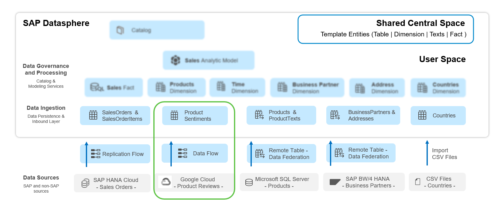

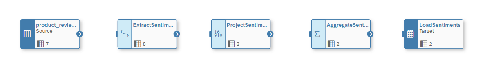

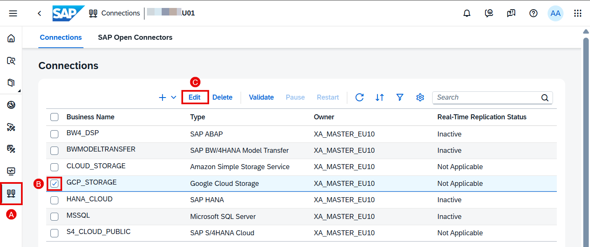

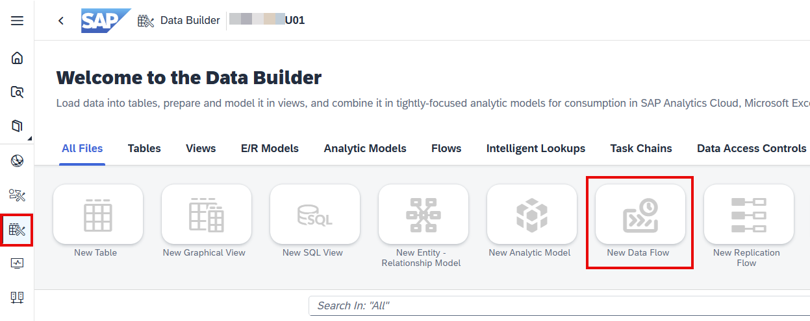

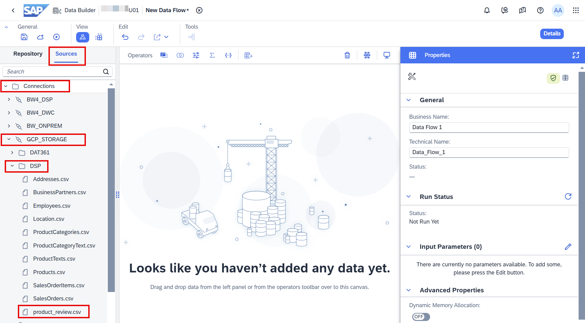

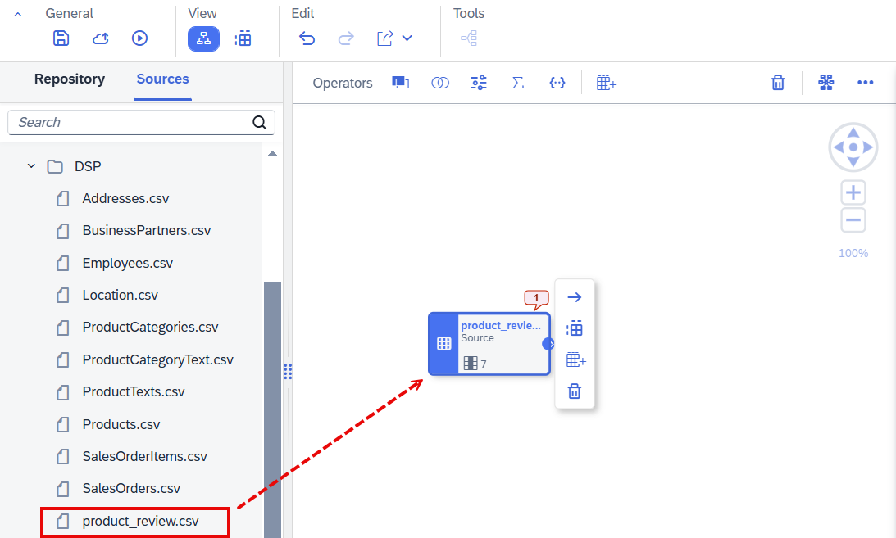

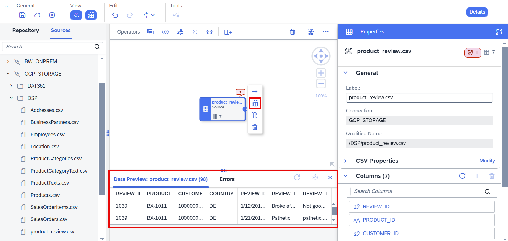

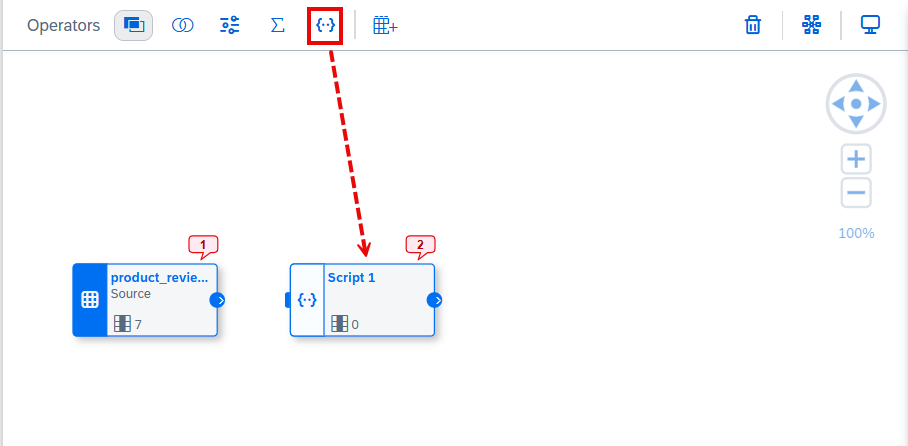

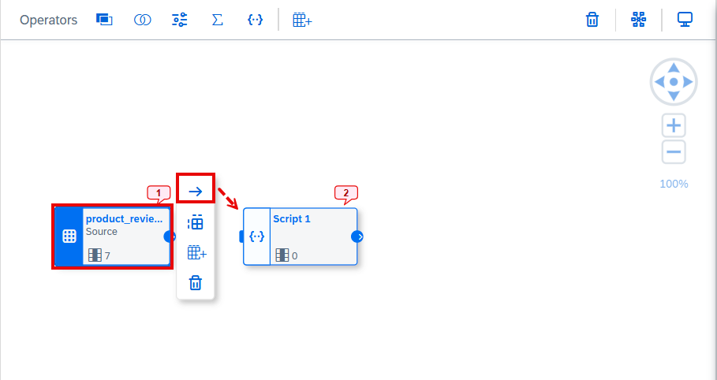

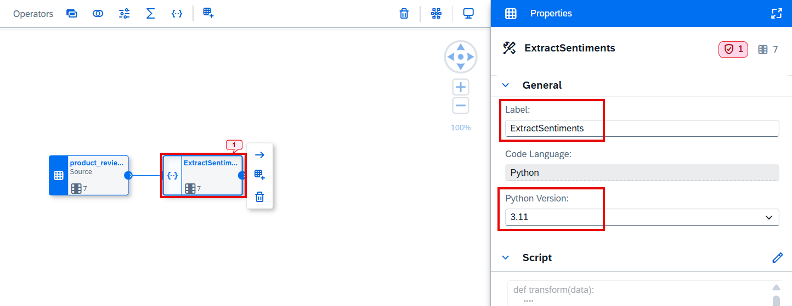

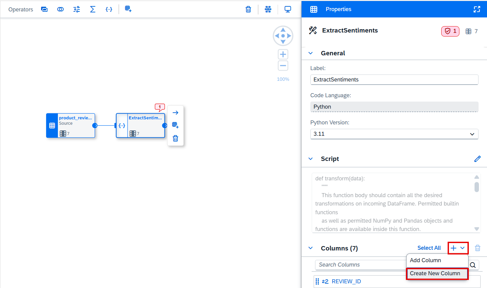

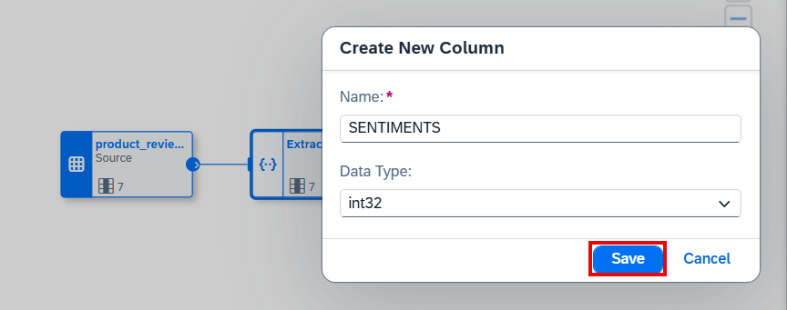

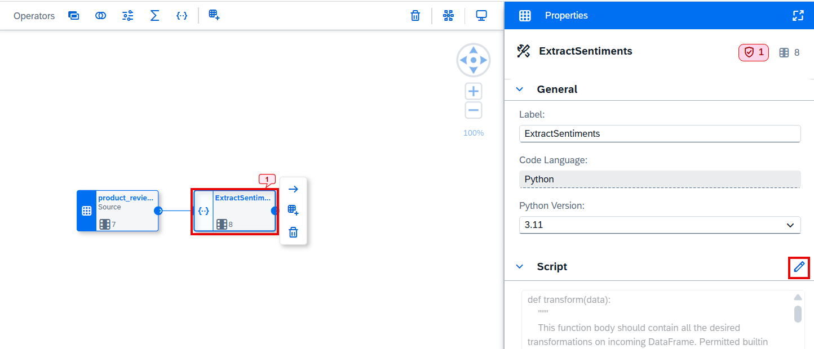

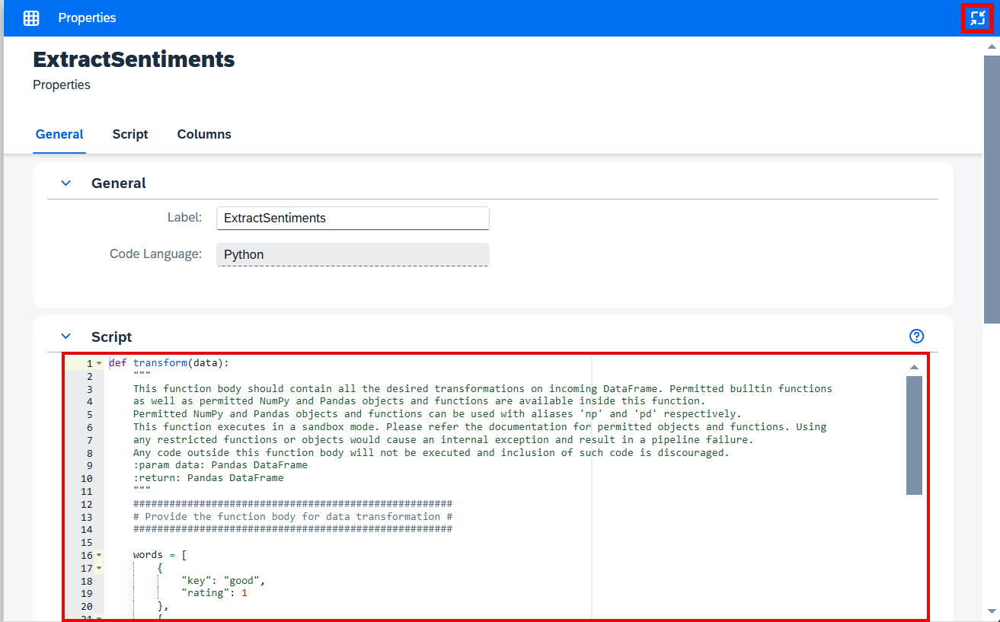

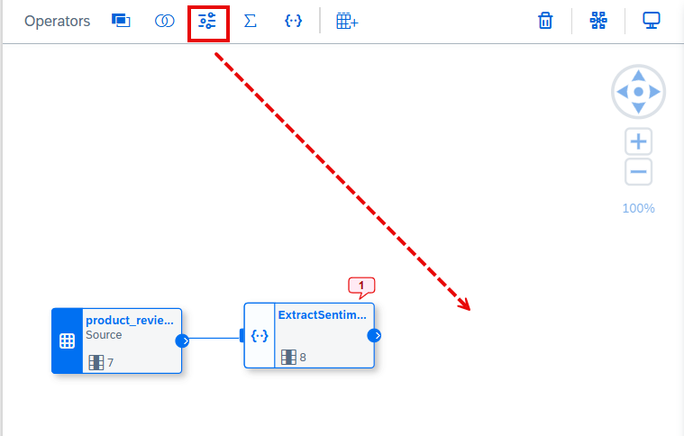

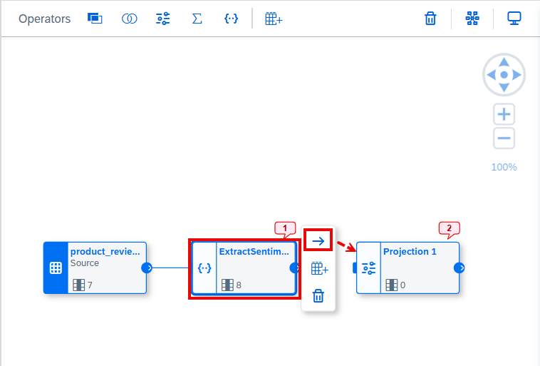

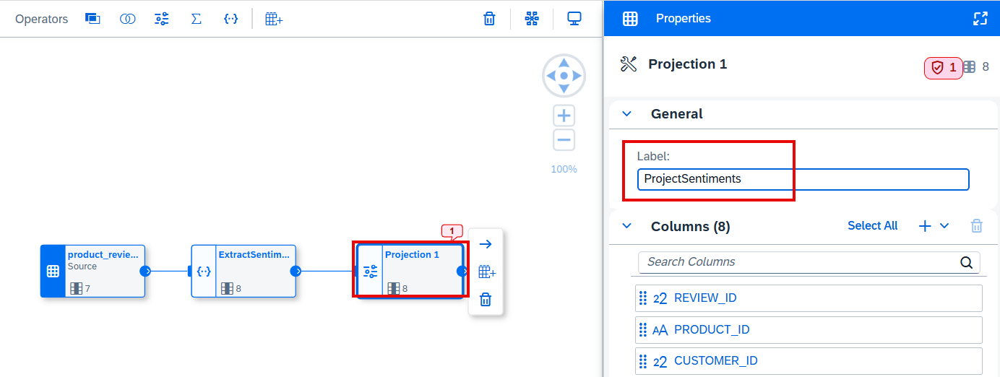

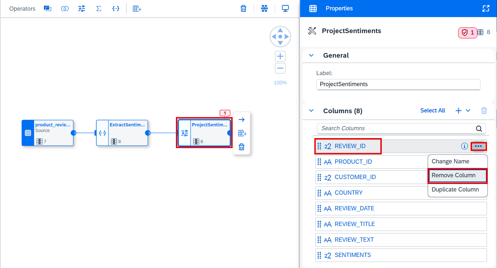
