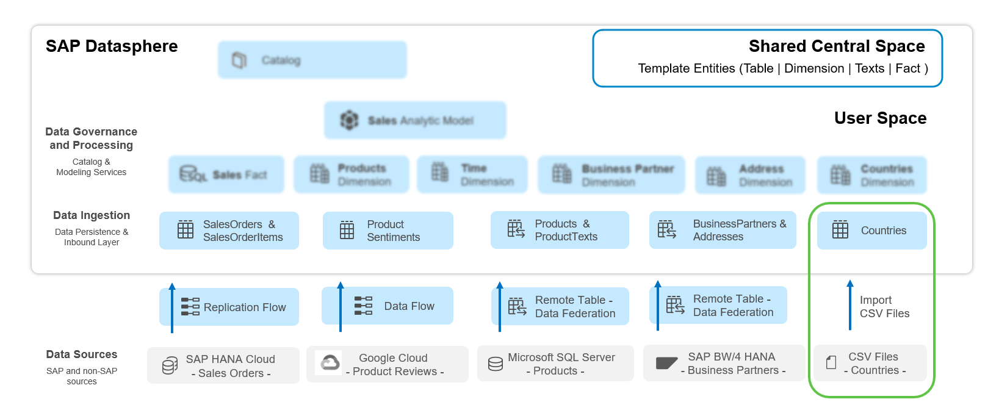
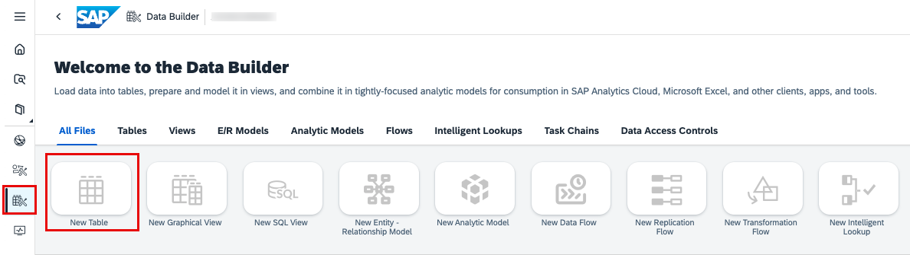
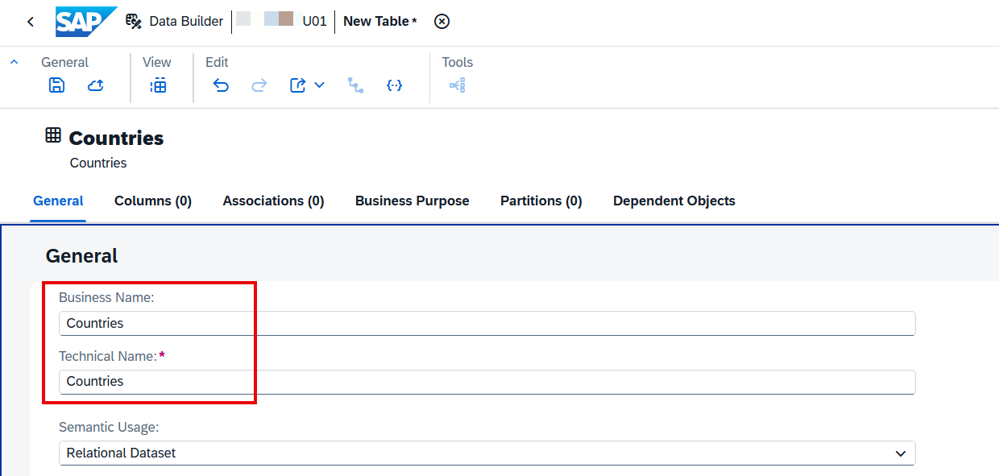
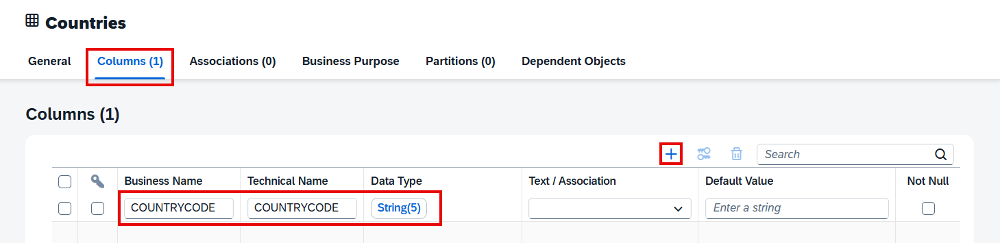
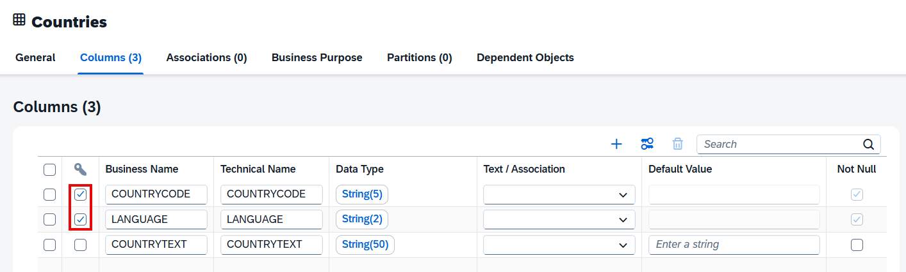
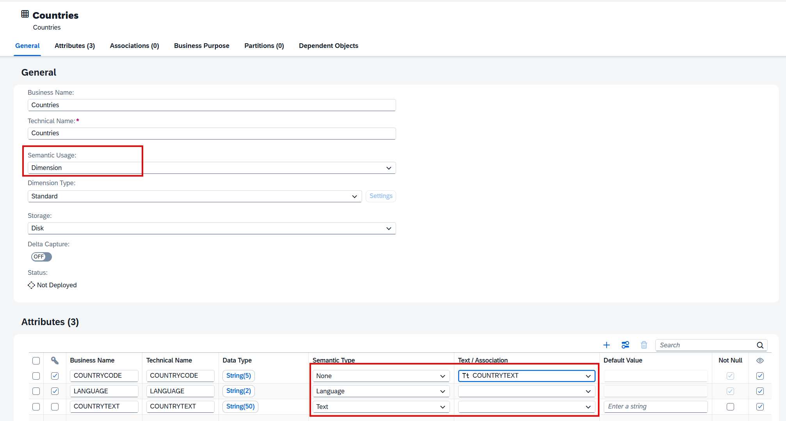
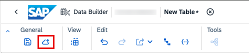
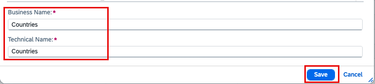
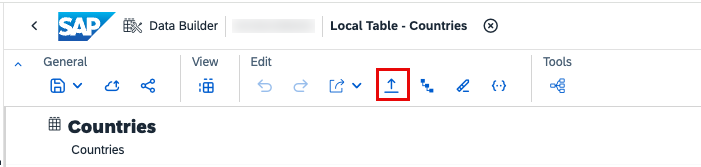
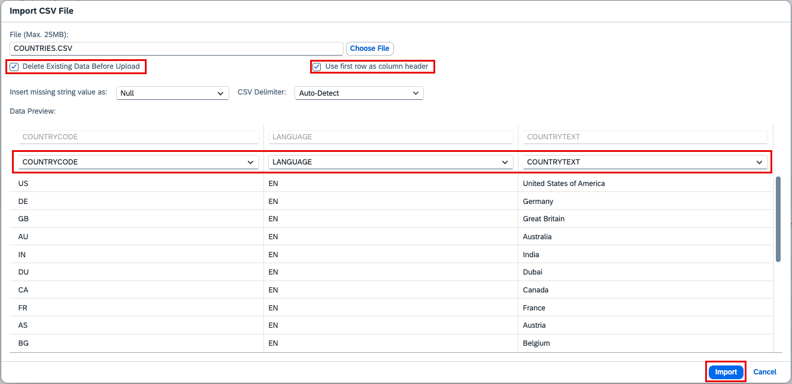

# 직접 데이터 업로드 (Direct Data Upload)

> **원본 레슨**: dsp-overview-local-table | **소요시간**: 5분

## 학습 목표
국가별 데이터를 위한 로컬 테이블을 생성하고 CSV 데이터를 직접 업로드합니다.

## 주요 내용

### 개요
국가 관련 정보를 담은 테이블을 생성하고 CSV 파일로 데이터를 업로드합니다. 이후 테이블의 기본 관계형 시맨틱을 **Dimension**으로 변경합니다.

SAP Datasphere에서 빈 테이블을 생성하고 데이터를 가져오는 방법:
- CSV 파일 또는 Data Flow로 데이터를 받을 빈 로컬 테이블 생성
- SAP 및 파트너가 제공하는 비즈니스 콘텐츠 가져오기
- CSN/JSON 파일에서 오브젝트 정의 가져오기

### 1단계: 로컬 테이블 생성
1. **Data Builder**를 선택하고 스페이스를 선택합니다.
2. **New Table** 타일을 선택하여 테이블 편집기를 엽니다.
3. 다음 정보를 입력합니다:
   - Business Name: `Countries`
   - Technical Name: `Countries`
4. Columns 섹션으로 스크롤하여 "**+**" 아이콘으로 컬럼을 추가합니다.
   - 각 컬럼에 Business Name, Technical Name, Data Type을 지정합니다.

### 2단계: 테이블 및 속성 시맨틱 설정
1. 테이블의 **Semantic Usage**를 **Dimension**으로 변경합니다.
2. 키 컬럼을 지정합니다.
3. 테이블을 **저장(Save)**하고 **배포(Deploy)**합니다.

### 3단계: CSV 파일에서 데이터 업로드
1. 배포된 테이블에서 **Upload Data from CSV File**을 선택합니다.
2. CSV 파일을 선택하고 컬럼 구분자 등 설정을 확인합니다.
3. **Import**를 클릭하여 데이터를 업로드합니다.
4. **Data Preview**로 업로드된 데이터를 확인합니다.

## 핵심 포인트
- 로컬 테이블은 CSV 업로드 또는 Data Flow로 데이터 수신 가능
- **Semantic Usage**로 테이블 용도(Dimension, Fact 등) 정의
- 테이블 배포 후 CSV 업로드 가능
- **Countries** 테이블은 이후 데이터 모델링에서 차원으로 활용

## 화면 스크린샷

