# Address Dimension 정의

> **원본 레슨**: dsp-overview-address-dimension | **소요시간**: 15분

## 학습 목표
Dimension 시맨틱 유형의 그래픽 뷰를 생성하고, 지오코드 데이터와 계층 구조를 추가하며 다른 차원과 연관(Association)을 설정합니다.

## 주요 내용

### 개요
**Address Dimension** 뷰를 생성합니다. SAP Analytics Cloud의 Geo Map 기능을 지원하기 위해 지리 좌표(Geo-Coordinates)를 추가하고, 지역→국가→도시 레벨의 위치 계층을 정의합니다. 마지막으로 **Countries** 차원 테이블과 연결합니다.

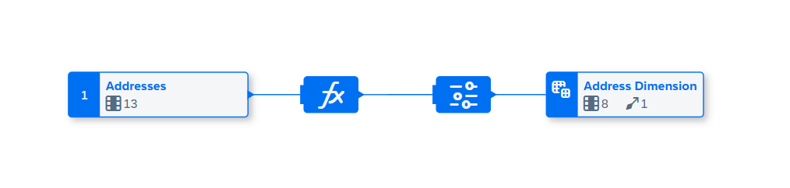

### 1단계: Address Dimension 뷰 생성
1. **Data Builder**에서 **New Graphical View**를 열고 `Addresses` 테이블을 캔버스로 드래그합니다.
2. 출력 노드 `View 1`을 선택하고 오른쪽 속성 패널에서 Business Name을 `Address Dimension`으로 변경합니다.

### 2단계: 지오 좌표 컬럼 추가
1. **Calculated Column** 노드를 추가합니다.
2. 위도(Latitude)와 경도(Longitude)를 결합하는 계산 컬럼을 정의합니다 (SAC Geo Map 지원용).
3. 컬럼의 시맨틱을 **Geo-Coordinates**로 설정합니다.

### 3단계: 국가 컬럼 복제
- 이후 연관 설정을 위해 **Country** 컬럼을 복제합니다.

### 4단계: Projection 추가
- 불필요한 컬럼을 제외하는 Projection 노드를 추가합니다.

### 5단계: 레벨 기반 계층 추가
1. 출력 노드에서 **Hierarchy** 탭을 선택합니다.
2. **Level-Based Hierarchy**를 추가합니다.
3. 레벨 구성: `Region` → `Country` → `City` 순서로 계층을 정의합니다.

### 6단계: Dimension Association 추가
1. 출력 노드에서 **Association** 탭을 선택합니다.
2. `Countries` 테이블과 연관을 추가합니다.
3. 조인 조건: `Country = CountryCode` 매핑

### 7단계: 배포 및 영속화
1. 뷰를 **저장(Save)**하고 **배포(Deploy)**합니다.
2. **Enable Data Persistence**를 활성화하여 주소 차원 데이터를 영속화합니다.

## 핵심 포인트
- **Geo-Coordinates** 시맨틱으로 SAC Geo Map 기능 지원
- **Level-Based Hierarchy**로 드릴다운 분석 가능 (지역→국가→도시)
- **Association**으로 차원 간 관계 정의 → SAC에서 자동 조인

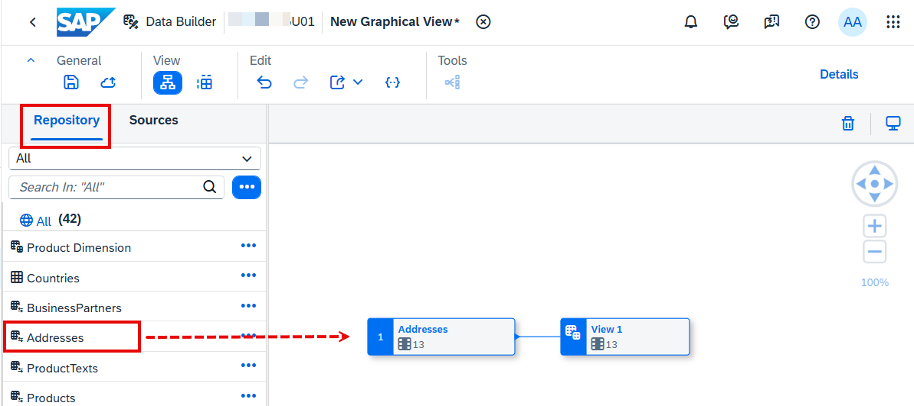

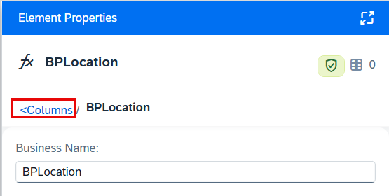
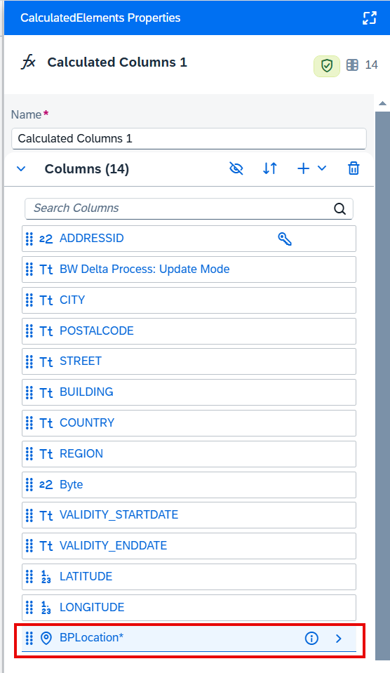

- **Impact & Lineage Analysis**에서 오브젝트 간 의존 관계 시각화

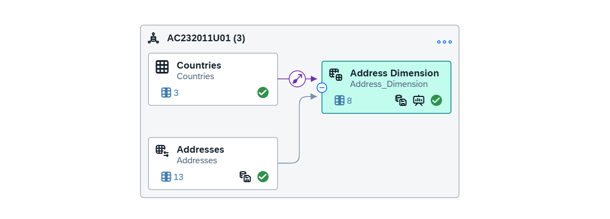
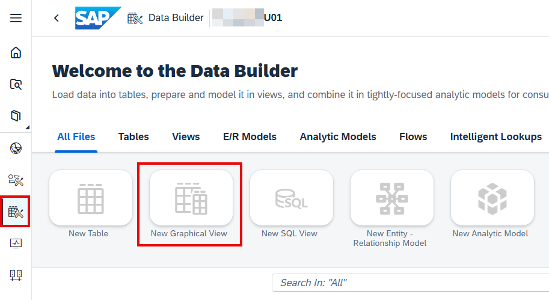
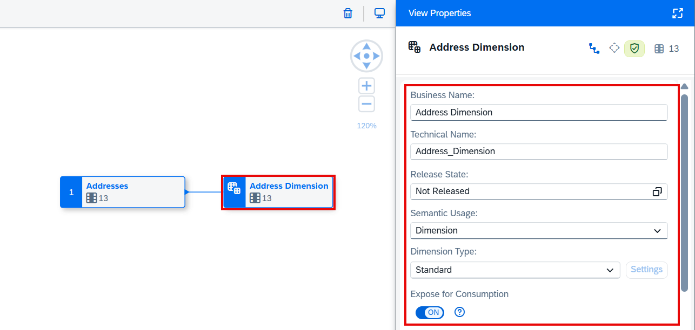
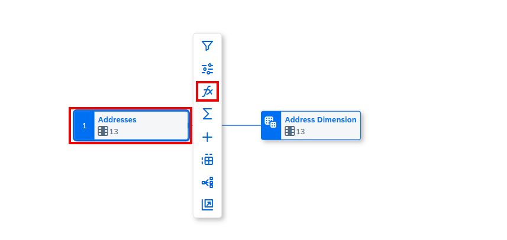
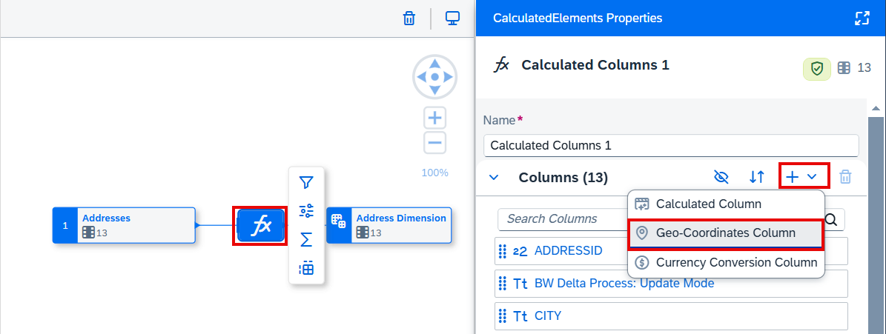
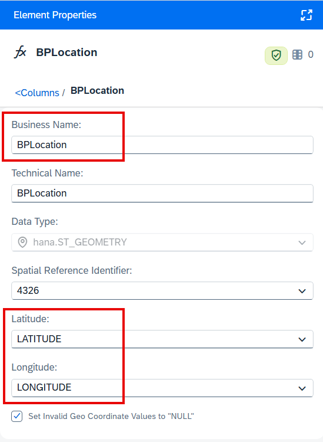
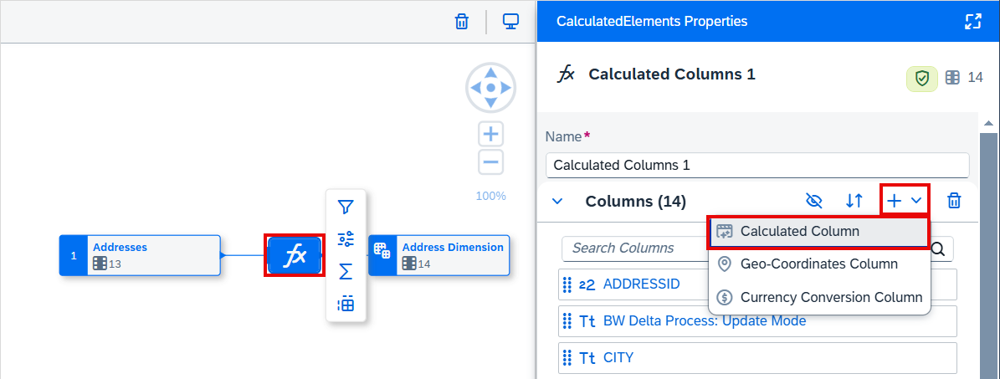
