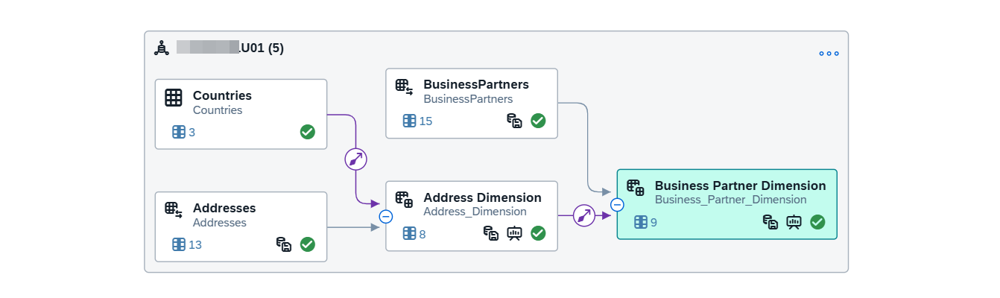
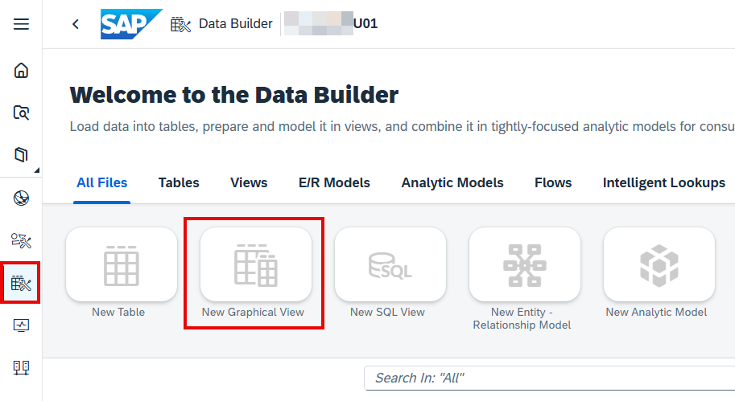
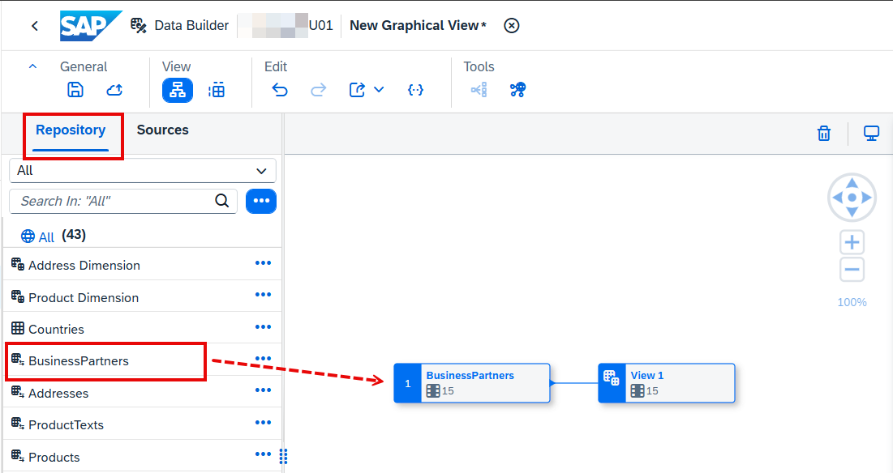
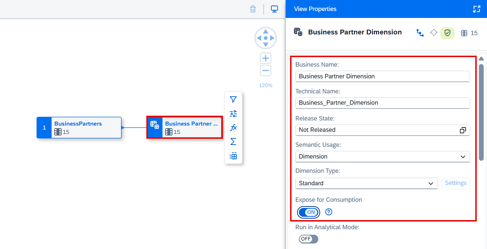
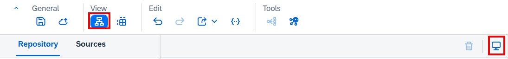
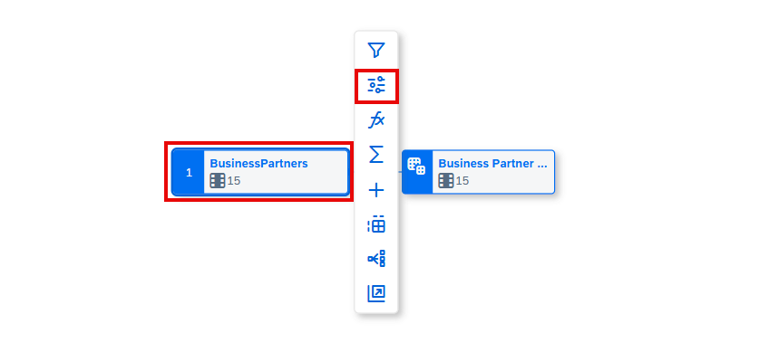
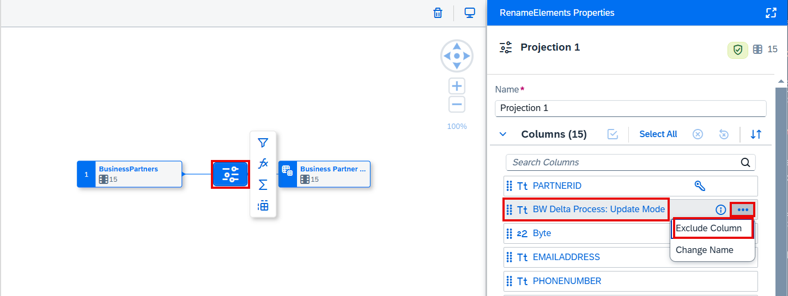
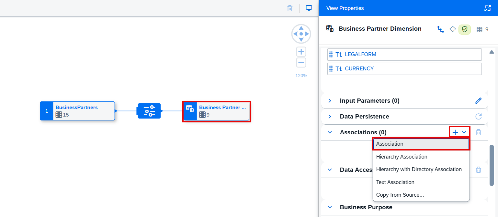

# Business Partner Dimension 정의

> **원본 레슨**: dsp-overview-business-partner-dimension | **소요시간**: 5분

## 학습 목표
Dimension 시맨틱 유형의 그래픽 뷰를 생성하고, Address Dimension과 연관(Association)을 설정한 후 데이터를 영속화합니다.

## 주요 내용

### 개요
**Business Partner Dimension** 뷰를 생성합니다. 컬럼 속성과 시맨틱을 정의하고, **Address Dimension** 뷰와 연관을 설정합니다.

### 1단계: Business Partner Dimension 뷰 생성
1. **Data Builder**에서 **New Graphical View**를 선택합니다.
2. **Repository** 탭에서 `BusinessPartners` 테이블을 캔버스로 드래그합니다.
   - 이전 단원에서 생성하지 않은 경우 공유 오브젝트 `4OV_BusinessPartners`를 사용합니다.
3. 출력 노드 `View 1`을 선택하고 Business Name을 `Business Partner Dimension`으로 변경합니다.
4. **Semantic Usage**를 **Dimension**으로 변경합니다.

### 2단계: Projection 추가
- 분석에 불필요한 컬럼을 제외하는 Projection 노드를 추가합니다.

### 3단계: Dimension Association 추가
1. 출력 노드의 **Association** 탭을 선택합니다.
2. `Address Dimension` 뷰와 연관을 추가합니다.
3. 조인 조건: `AddressID` 컬럼 기준 매핑

### 4단계: 속성 시맨틱 설정
- 각 컬럼의 시맨틱(Label, Key 등)을 설정합니다.
- `BusinessPartnerID`를 키 속성으로 지정합니다.

### 5단계: 배포 및 영속화
1. 뷰를 **저장(Save)**하고 **배포(Deploy)**합니다.
2. **Enable Data Persistence**로 마스터 데이터를 영속화합니다.

## 핵심 포인트
- **Association** 체인: Business Partner → Address → Countries (다단계 연관 가능)
- **Impact & Lineage Analysis**에서 연관 관계 시각화 가능
- 차원 뷰 영속화로 SAC 리포트 성능 향상

## 화면 스크린샷

