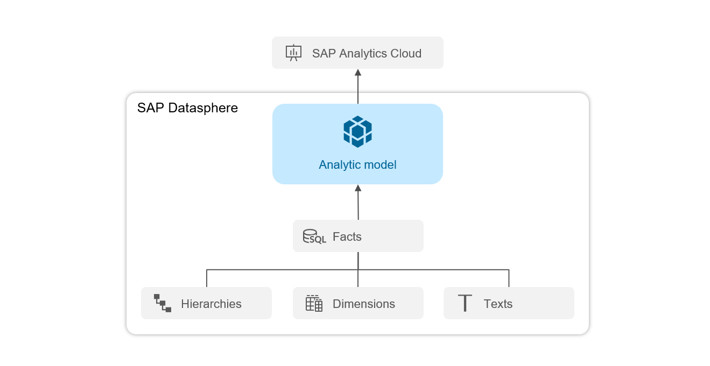
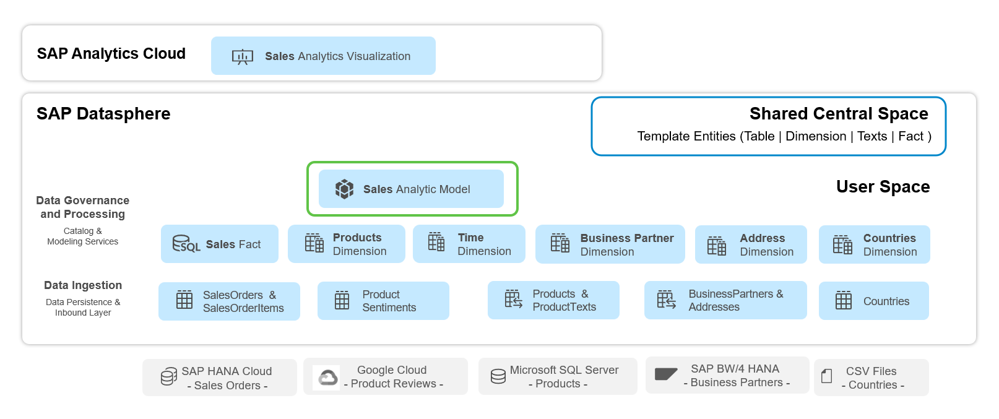
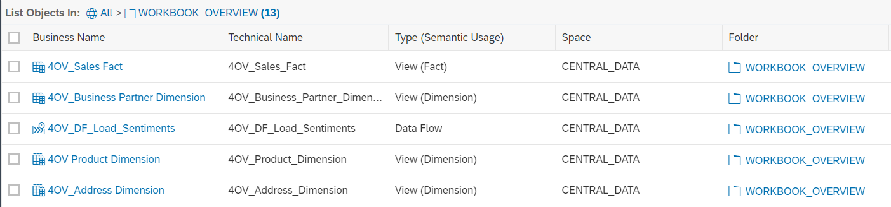

# 16. Analytic Modeling 소개 (Introduction)

**소요 시간:** 약 2분

## 학습 목표

Analytic Model의 개념과, 전체 시나리오 아키텍처에서 어떤 위치에 속하는지 이해합니다.

## 주요 내용

**Analytic Model**은 SAP Analytics Cloud에서 데이터를 분석 목적으로 소비하기 위한 핵심 분석 기반입니다. 사전 정의된 측정값(Measure), 계층(Hierarchy), 필터, 파라미터, 연계(Association)를 통해 다차원 데이터 구조를 유연하게 탐색할 수 있습니다.

### 이 단원에서 학습할 내용

- 차원(Dimension)과 측정값(Measure)을 포함한 **Analytic Model** 설계
- 다양한 유형의 신규 측정값 생성
- 입력 변수(Input Variable)와 필터 정의
- 데이터 미리보기를 통한 모델링 결과 검증
- 미리보기 내 정렬 변경, 계층 탐색, 필터 적용
- SAP Analytics Cloud 사용자가 모델을 어떻게 보는지 이해

### 시나리오 아키텍처

이번 단원에서 생성하는 **Sales Analytic Model**은 분석 기반 역할을 합니다. 이 모델은 다음 팩트 및 차원 엔티티에 의존합니다:

- **Sales Fact** — 매출 팩트 테이블
- **Product Dimension** — 제품 차원
- **Business Partner Dimension** — 비즈니스 파트너 차원
- **Address Dimension** — 주소 차원
- **Countries Dimension** — 국가 차원

워크샵의 모든 데이터는 **Central Space**에 미리 정의되어 있으며, 개인 사용자 스페이스로 공유됩니다.

### [Optional] 모듈형 접근 방식

이전 Data Modeling 단원을 완료하지 않은 경우, **4OV_Sales Fact** 오브젝트를 대신 사용할 수 있습니다. 해당 오브젝트는 **CENTRAL DATA** 스페이스의 **WORKBOOK_OVERVIEW** 폴더에 저장되어 있으며, **Repository Explorer** 또는 **Analytic Builder**의 **Source Tree Explorer**에서 확인할 수 있습니다.
