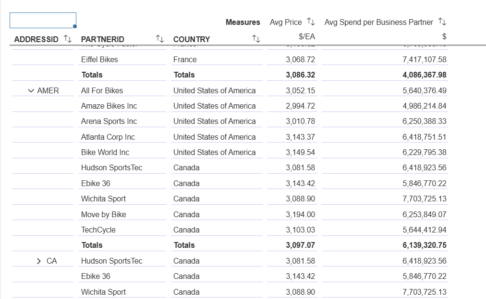
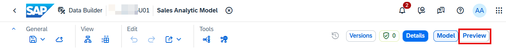
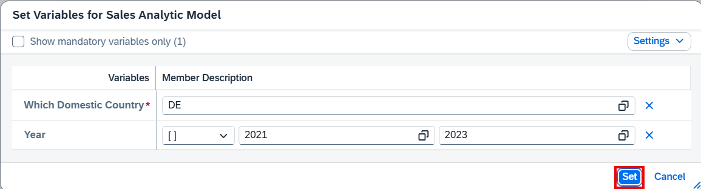
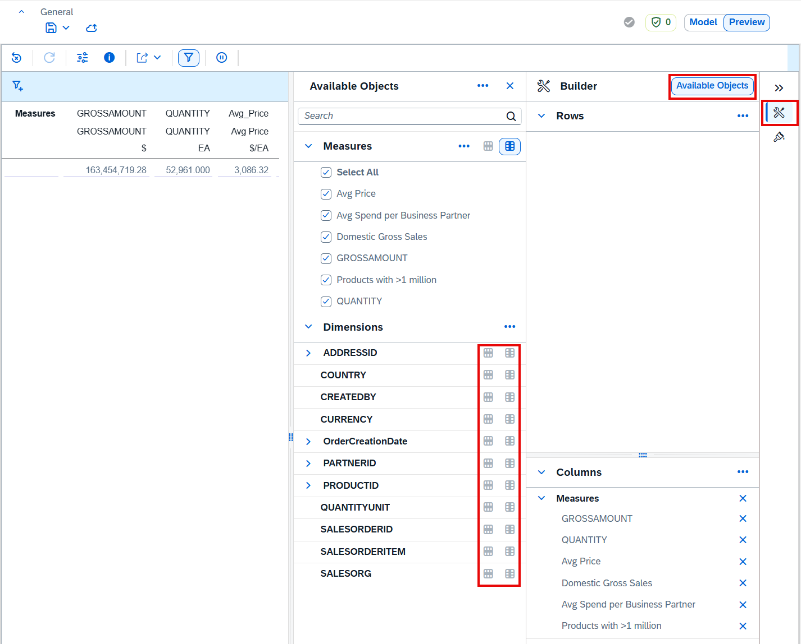
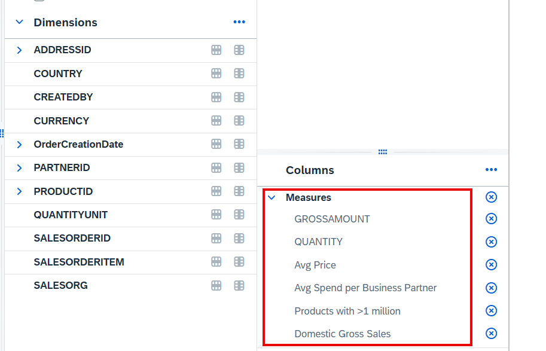
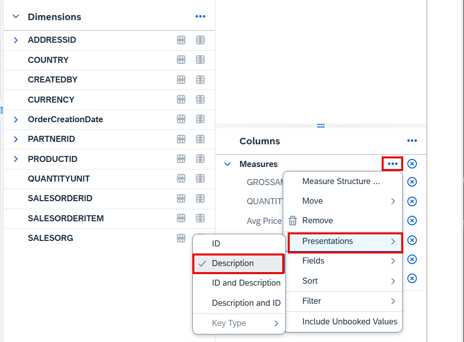
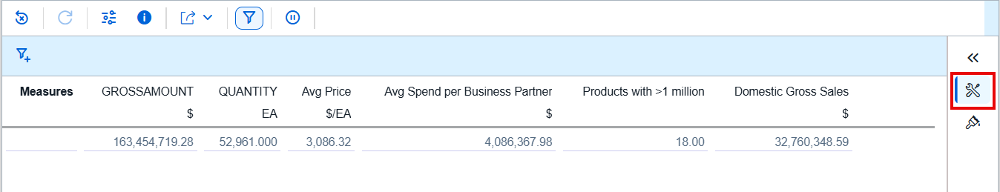
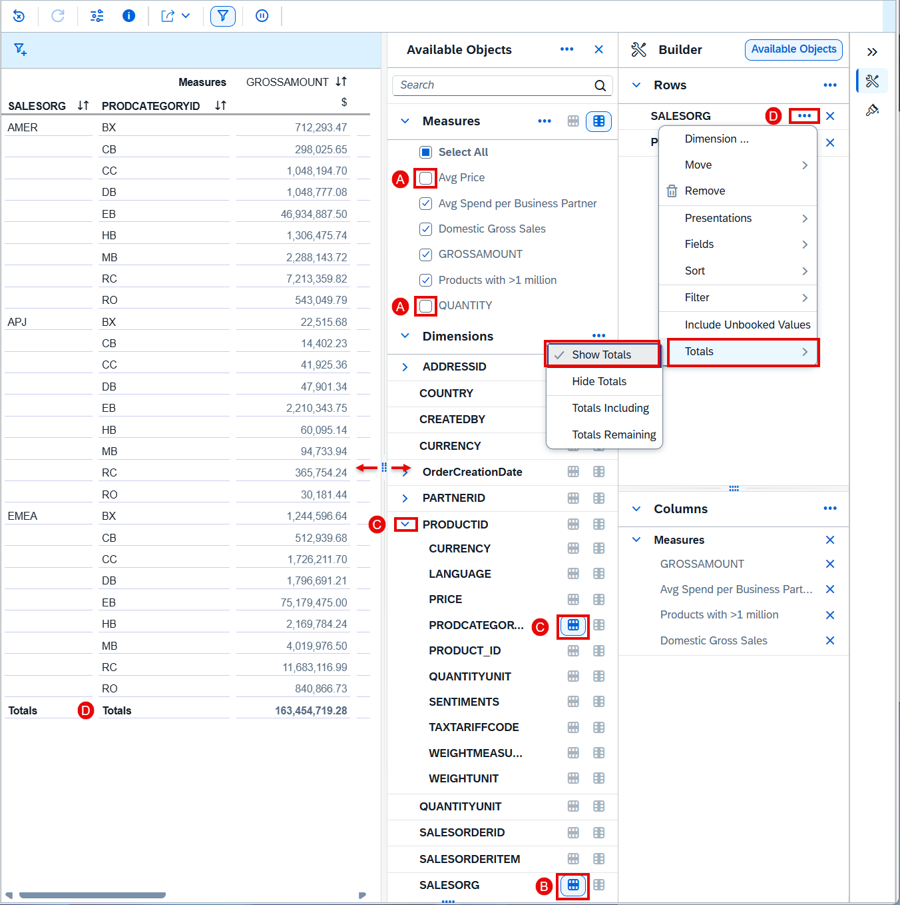

# 18. Analytic Model 데이터 미리보기 (Preview the Analytic Model Data)

**소요 시간:** 약 10분

## 학습 목표

모델링 결과를 미리보기로 확인하고, SAP Analytics Cloud 사용자가 보는 화면을 직접 체험합니다. 다양한 관점으로 시각화하고, 필터 설정과 입력 변수 변경도 실습합니다.

## 주요 내용

**Analytic Model 미리보기** 화면에서는 여러 차원을 탐색하고 집계 데이터를 조회할 수 있습니다. 행/열 드릴다운, 측정값/차원 필터, 표시 방식 변경, 계층 탐색, 페이지 레이아웃 조정 등이 가능합니다.

이 미리보기 화면이 SAP Analytics Cloud BI Reporting에서 실제로 보이는 모습과 동일합니다.

### 단계별 실습 내용

**모델 미리보기 전환**
- Analytic Model 편집기 우측 상단의 **Preview** 토글을 선택하여 분석 데이터 미리보기로 전환
- **Model** ↔ **Preview** 화면을 자유롭게 전환 가능

**입력 변수 설정 (User Input Prompts)**
- 입력 변수 값을 설정하는 프롬프트가 표시됨
- 기본값을 확인하고 **Set** 버튼 클릭
- 참고: 2020년 이전 판매 주문 데이터는 Sales Fact 모델에 포함되지 않음

**탐색 드릴다운 (Navigation Drill Down)**
- 미리보기 화면에 모든 측정값이 표시됨
- 헤더 행에 측정값 이름과 값(통화), 수량(단위) 의미 정보가 함께 표시
- **Builder Panel**을 통해 차원/측정값 할당 및 행/열 구성 가능

**변수 필터 변경 (Change Variable Filter)**
- 입력 변수 값을 동적으로 변경하여 다른 기간/조건의 데이터 조회

**필터 추가 (Add Filter)**
- 특정 차원 속성에 필터를 적용하여 데이터 범위 제한

**위치 계층 탐색 (Location Hierarchy)**
- 주소 차원의 계층 구조를 탐색하여 지역별 데이터 드릴다운

**비즈니스 파트너 리포트 (Business Partner Report)**
- Business Partner 차원 기준 데이터 조회 및 분석

> 💡 더 자세한 내용은 SAP Help Portal의 **Using the Data Preview** 문서를 참조하세요.

## 화면 스크린샷

