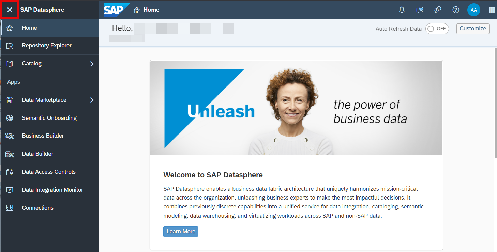
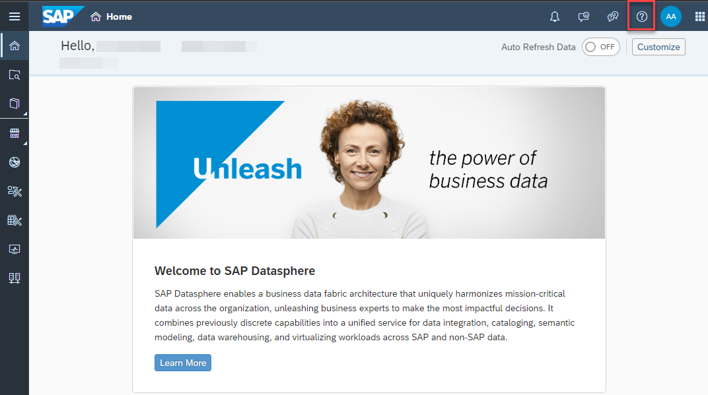
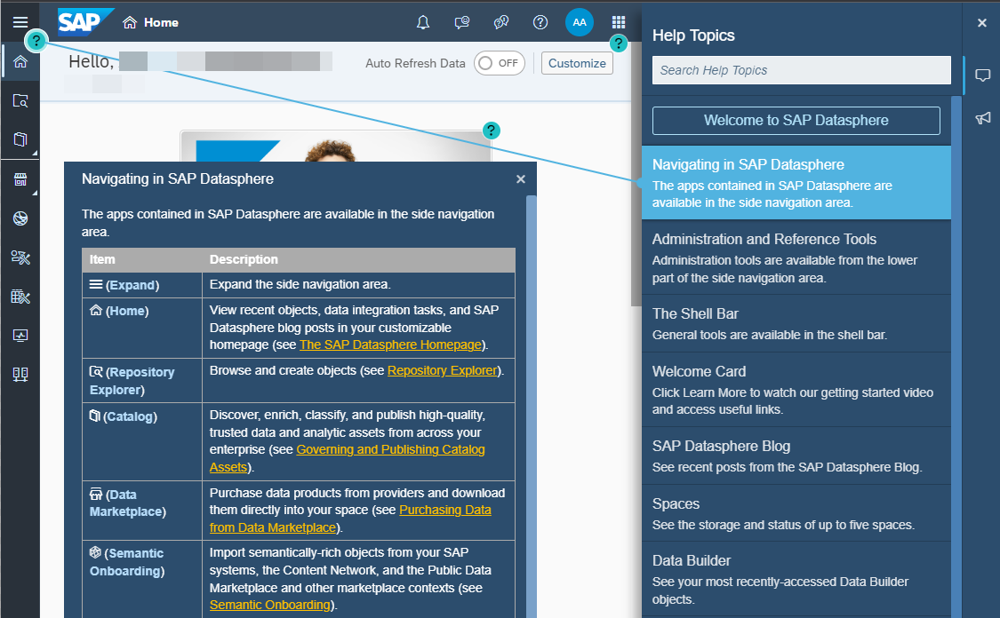
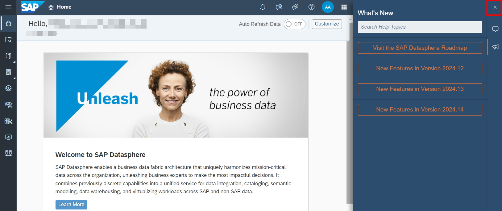
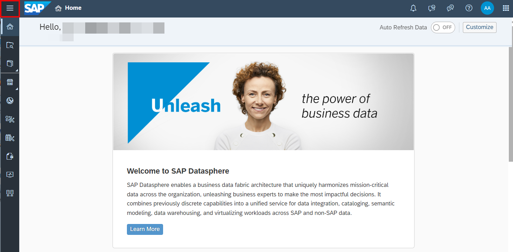

# 21. [Optional] SAP Datasphere 로그온

**소요 시간:** 약 5분

## 학습 목표

SAP Datasphere에 로그온하고 홈 화면의 주요 구성 요소를 확인합니다.

## 주요 내용

Chrome 브라우저를 열고 워크샵 주관자가 제공한 SAP Datasphere URL로 접속한 후, 개인 사용자 자격 증명으로 로그인합니다.

> 💡 로그온 문제 발생 시: Chrome 브라우저 캐시 삭제(CTL+H) 또는 시크릿 창(Incognito)으로 접속하세요.

### SAP Datasphere 홈 화면 주요 기능

- **최근 오브젝트**, **빠른 작업**, **블로그 게시물** 카드 표시
- 카드 표시/숨기기/순서 변경 가능
- 좌측 상단 사이드 네비게이션 메뉴 확장/축소
- 우측 상단 **"?"** 아이콘: 인앱 도움말 패널 열기 (현재 앱과 연관된 도움말 표시)
- **What's New** 메가폰 아이콘: 최신 릴리즈 기능 정보 확인
