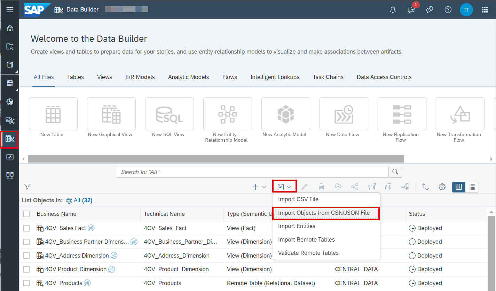
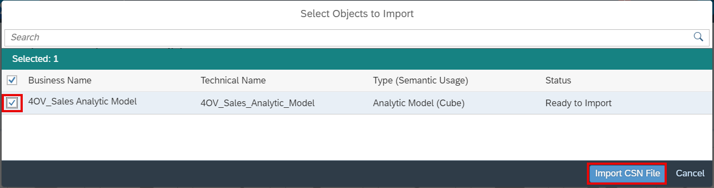
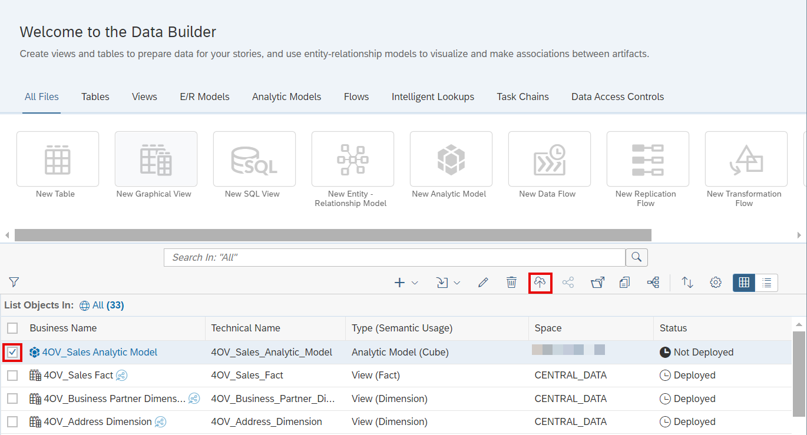
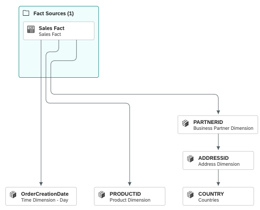
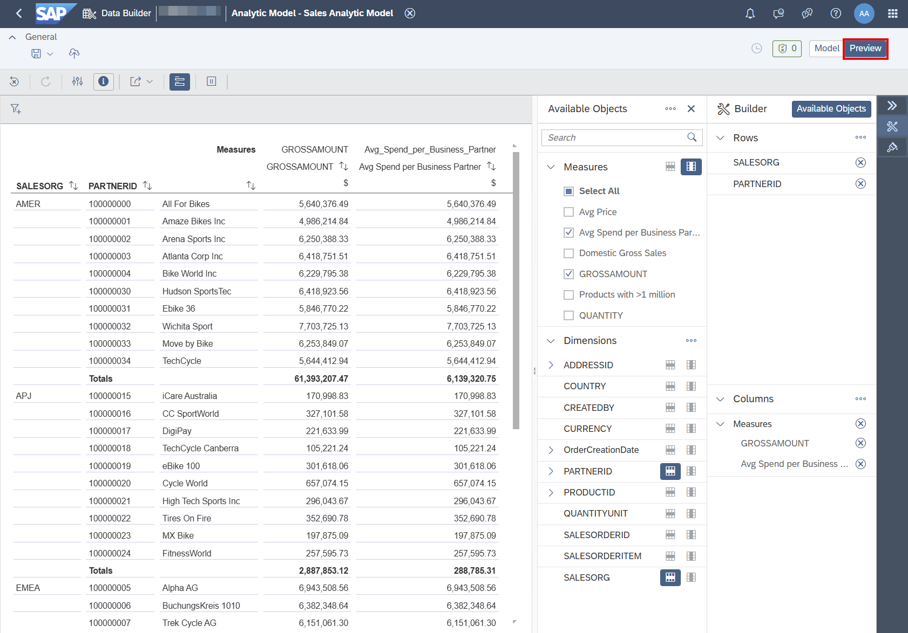

# 22. [Optional] Analytic Model 임포트

**소요 시간:** 약 10분

## 학습 목표

JSON 파일에서 Analytic Model 템플릿을 임포트하여 SAP Analytics Cloud 시각화 단원을 진행할 수 있도록 준비합니다.

## 주요 내용

이전 단원에서 **Sales Analytic Model**을 직접 생성하지 않은 경우, 사전 정의된 템플릿을 사용합니다. Analytic Model은 다른 스페이스로 공유할 수 없으므로 JSON 파일로 제공됩니다.

### JSON 파일 업로드

1. `4OV_SALES_ANALYTIC_MODEL.JSON` 파일을 로컬에 다운로드
2. 사이드 네비게이션에서 **Data Builder** 선택 후 개인 스페이스 선택
3. 상단 툴바에서 **Import → Import Objects from CSN/JSON File** 선택
4. 다운로드한 JSON 파일 선택
5. **Select Objects to Import** 팝업에서 **4OV_Sales Analytic Model** 선택 후 **Import CSN File** 클릭
6. 임포트 완료 알림 확인 → 오브젝트 목록에 'Not Deployed' 상태로 표시됨

### 모델 배포 및 열기

1. **4OV_Sales Analytic Model** 선택 후 **Deploy** 아이콘 클릭
2. 배포 완료 알림 확인
3. [Optional] 모델을 열어 미리보기로 검증 가능

> 이 모델은 SAP Datasphere ↔ SAP Analytics Cloud 라이브 연결(Live Connection)의 소스로 활용됩니다.
