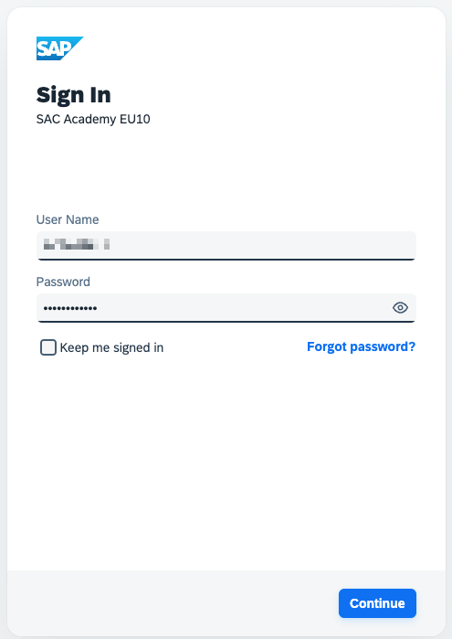
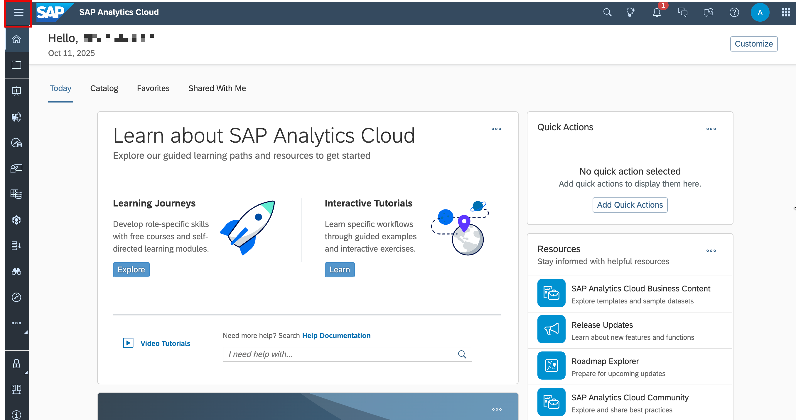
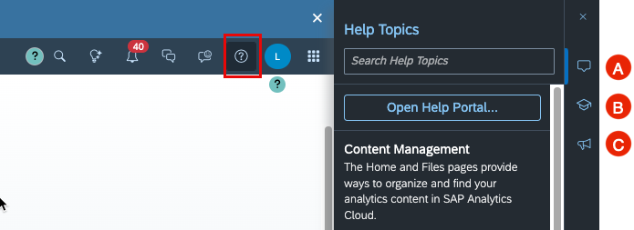

# 23. SAP Analytics Cloud 로그온

**소요 시간:** 약 5분

## 학습 목표

SAP Analytics Cloud에 로그온하고 기본 내비게이션 구조를 익힙니다.

## 주요 내용

Chrome 브라우저에서 SAP Analytics Cloud URL로 접속한 후 개인 자격 증명으로 로그인합니다.

### 로그온 절차

1. Chrome 브라우저에서 SAP Analytics Cloud URL 접속
2. 사용자 자격 증명 입력 (Username / Password)
3. 알림 수신 여부 팝업에서 **Decline** 선택

### 화면 내비게이션 구성

**사이드 내비게이션 바 (Side Navigation Bar)**
- 좌측 상단에서 확장/축소 가능
- 전체 기능 및 애플리케이션 목록 표시

**메인 툴바 (Main Toolbar)**
- 현재 화면의 브레드크럼(breadcrumb) 내비게이션 표시
- 검색, 알림, 협업, 도움말, 사용자 프로필 설정, 제품 전환(Product Switch) 등 범용 기능 포함

**도움말 (Help)**
- **Main Toolbar**에서 **Help** 선택
  - (A) 컨텍스트 도움말 기사
  - (B) 학습 리소스
  - (C) 최신 기능 정보(What's New)

## 화면 스크린샷

