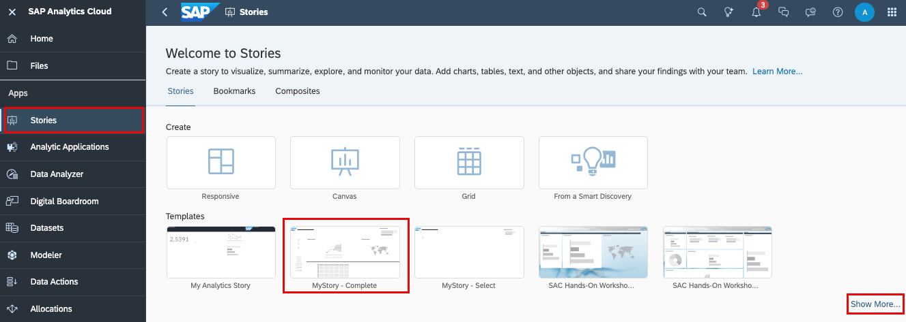
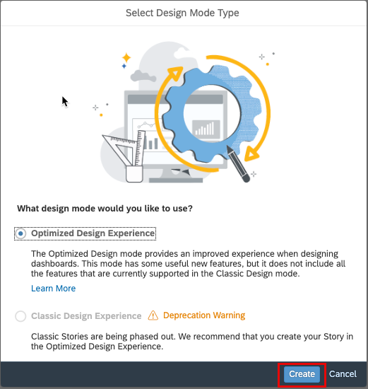
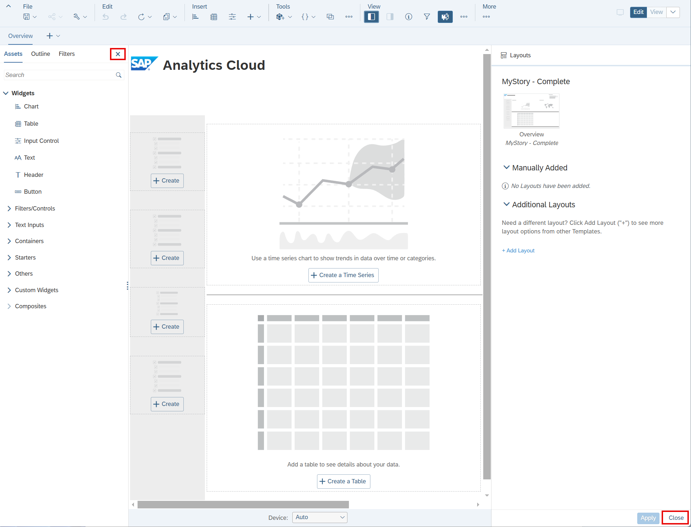
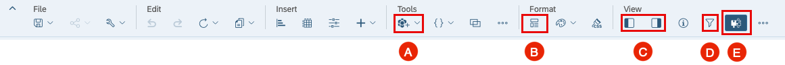
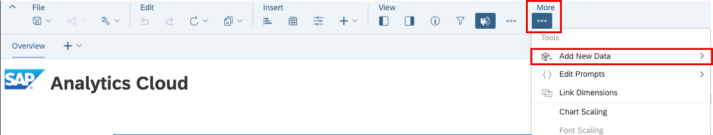
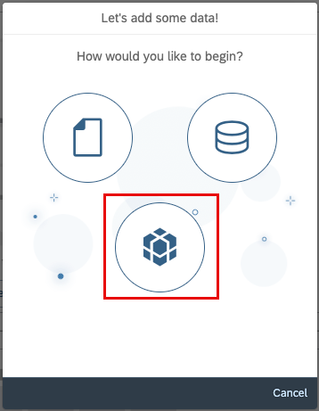
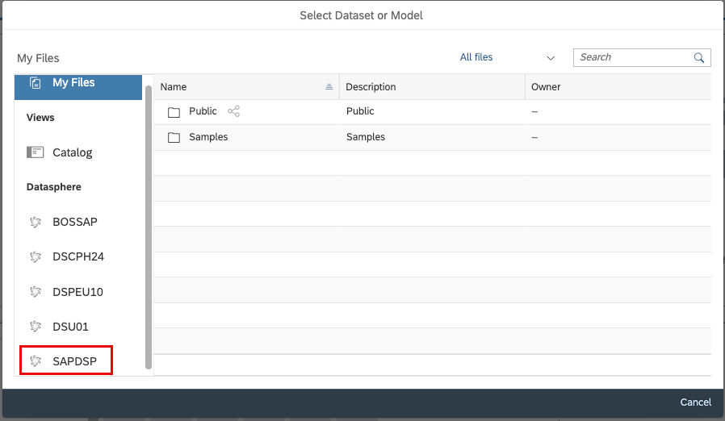

# 24. 새 Story 생성 (Optimized Story Experience)

**소요 시간:** 약 10분

## 학습 목표

기존 템플릿을 활용하여 SAP Analytics Cloud Story를 생성합니다.

## 주요 내용

처음부터 직접 만들지 않고 **템플릿**을 사용하면 Story 작성 시간을 단축할 수 있습니다. 템플릿에는 차트, 테이블, 지도, 입력 컨트롤 등의 자리 표시자가 포함된 사전 정의 페이지 레이아웃이 제공됩니다.

이 단원에서는 **Optimized Design Experience**를 사용하여 기존 템플릿 기반 Story를 생성하고, 라이브 데이터 연결을 통해 Analytic Model을 연결합니다.

### 단계별 실습

**새 Story 생성**
1. **Stories** 선택 후 **MyStory - Complete** 템플릿 선택
   - 더 많은 템플릿을 보려면 **Show More…** 선택
2. Optimized Design Experience 모드로 Story 열림
3. **Left Side Panel** 및 **Layouts Panel** 닫기

**Optimized Design Experience 주요 기능**
- (A) **Tools** 메뉴 → 새 데이터 소스 추가
- (B) **Format** 메뉴 → Layouts(템플릿)
- (C) **Views** 메뉴 → Left Side Panel (Assets, Outline, Filter 탭)

**데이터 모델 추가 (Add a Data Model)**
- SAP Datasphere에 대한 **Live Data Connection**에서 Analytic Model 연결
- 데이터 소스로 **Sales Analytic Model** 선택

**Story 저장**
- 작업 완료 후 **Save** 하여 Story 저장

> 💡 브라우저 크기에 따라 일부 기능만 표시될 수 있습니다.

