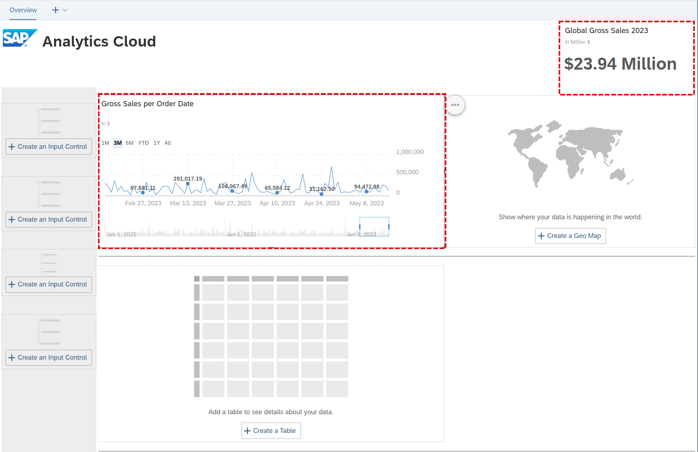
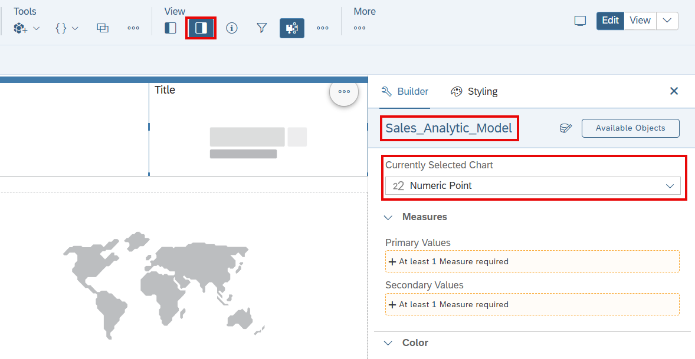
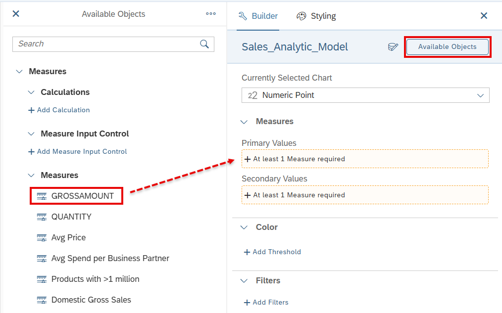
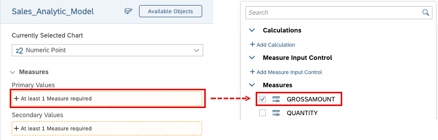
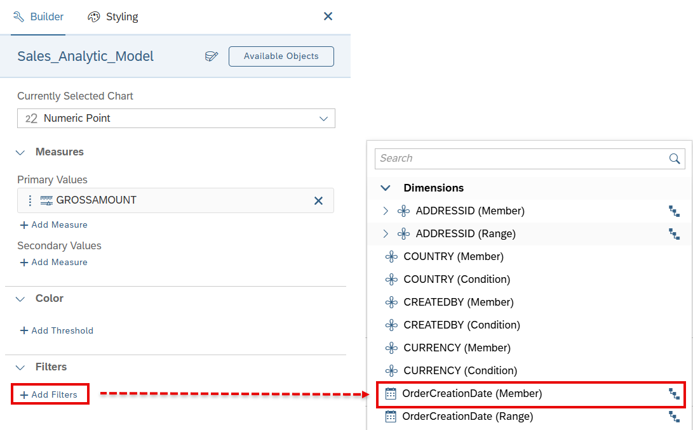
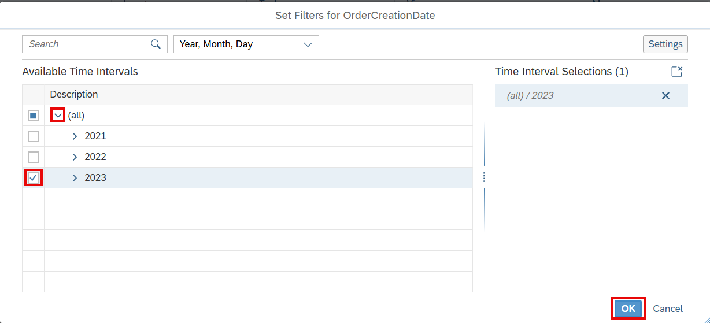
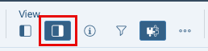
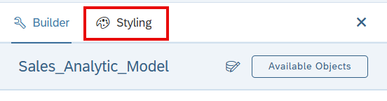

# 25. 차트 추가 (Add Charts)

**소요 시간:** 약 10분

## 학습 목표

Story에 **Numeric Point** 차트와 **Time Series** 차트를 추가합니다.

## 주요 내용

다양한 차트 유형을 활용하여 데이터의 여러 측면을 시각화합니다.

- **Numeric Point 차트**: 비즈니스 KPI 지표를 표시하는 인디케이터 차트. 단일 데이터 포인트를 표시하며 1개 이상의 기본 값 필요
- **Time Series 차트**: 시간 흐름에 따른 추세 분석 차트. 기본적으로 꺾은선 그래프로 데이터를 표시하며, 각 포인트는 시간과 값을 나타냄

### 단계별 실습

**Gross Sales Numeric Point 차트 추가**
1. Story를 편집 모드로 열기
2. 템플릿 헤더 레인의 `+` 플레이스홀더에서 **Numeric Point Chart** 생성
3. **Right Side Panel (Builder)** 에서 **GROSSAMOUNT**를 기본 값(Primary Value)으로 선택
4. KPI가 항상 2023년 데이터를 표시하도록 날짜 필터 추가
5. 표시 값 형식(포맷) 지정

**Time Series 차트 추가**
- 시간 축(Time Dimension)과 측정값을 설정하여 시계열 추세 차트 구성
- 차트 내비게이션으로 시계열 데이터 탐색

> 💡 SAP Help Portal의 **Visualizing Data with Charts** 문서를 참조하세요.

