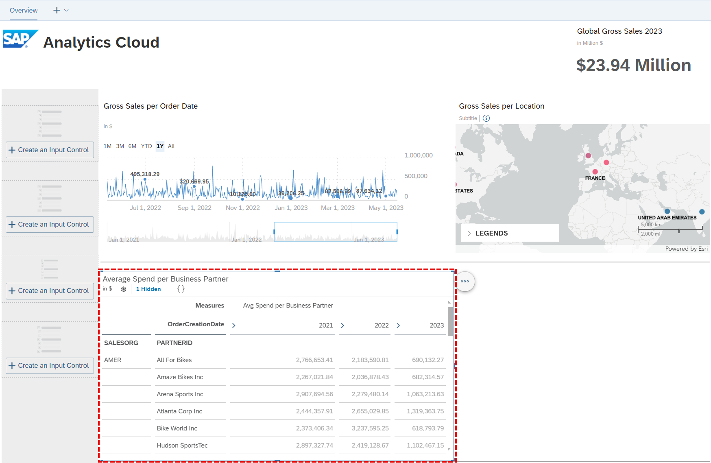
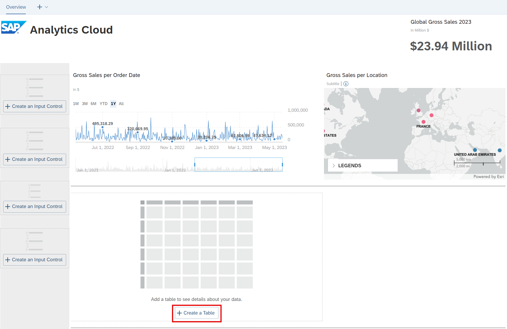
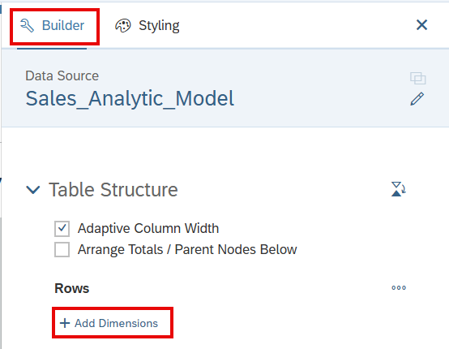
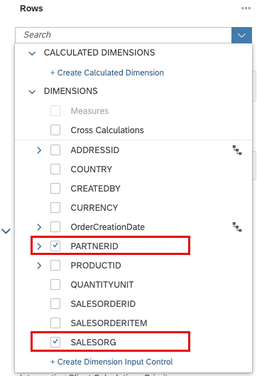
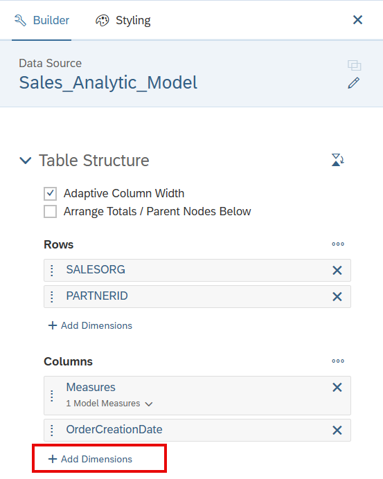
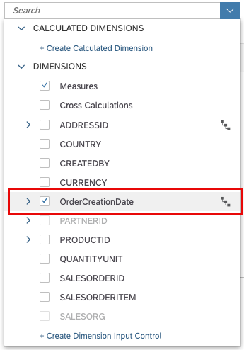

# 27. 테이블 추가 (Add Table)

**소요 시간:** 약 10분

## 학습 목표

Story에 테이블을 추가하여 데이터를 행/열 기준으로 분석합니다.

## 주요 내용

SAP Analytics Cloud Story에서 테이블은 데이터를 구조적으로 조회하고 분석하는 데 활용됩니다. 이 단원에서는 판매 조직(Sales Organization)별, 비즈니스 파트너별 평균 지출을 시간 흐름에 따라 확인하는 테이블을 추가합니다.

### 단계별 실습

**테이블 생성**
1. Story 편집 모드 열기
2. 템플릿 메인 레인의 `+` **Create a Table** 플레이스홀더 선택
3. **Right Side Panel (Builder, Styling)** 자동으로 열림

**행/열 차원 설정**
- **행(Rows)** → `+` **Add Dimension** → **SALESORG**, **PARTNERID** 추가
- **열(Columns)** → `+` **Add Dimension** → **OrderCreationDate** 추가
  - 날짜 계층(Year, Quarter, Month, Day) 사용 가능

**측정값 변경**
- **Manage Filters for Measures** 선택
- **Avg Price** 해제 → **Avg Spend per Business Partner** 선택

**계층 보기 및 숨기기**
- 테이블에서 날짜 계층 확장하여 연도별 상세 데이터 확인
- 전체 합산(**All** 노드) 숨김 처리로 필요한 데이터만 표시

> 💡 SAP Help Portal의 **Tables** 문서를 참조하세요.

