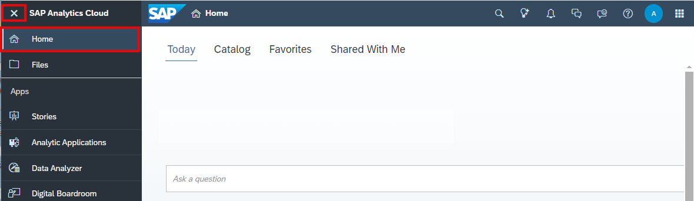
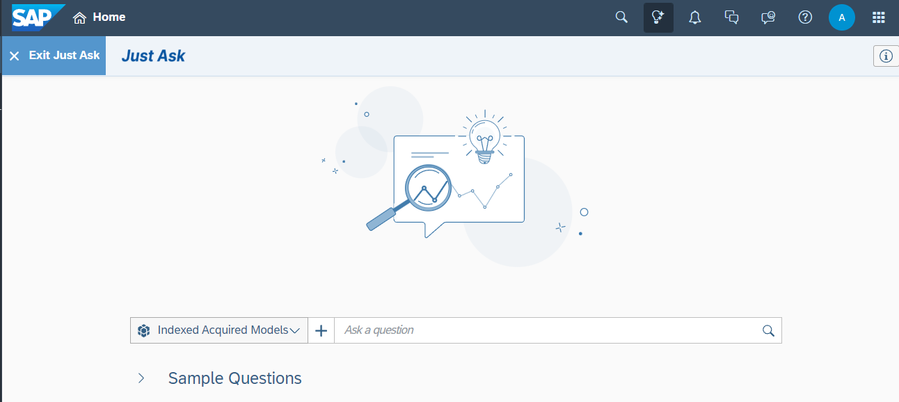
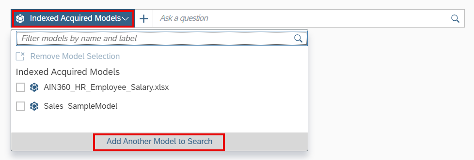
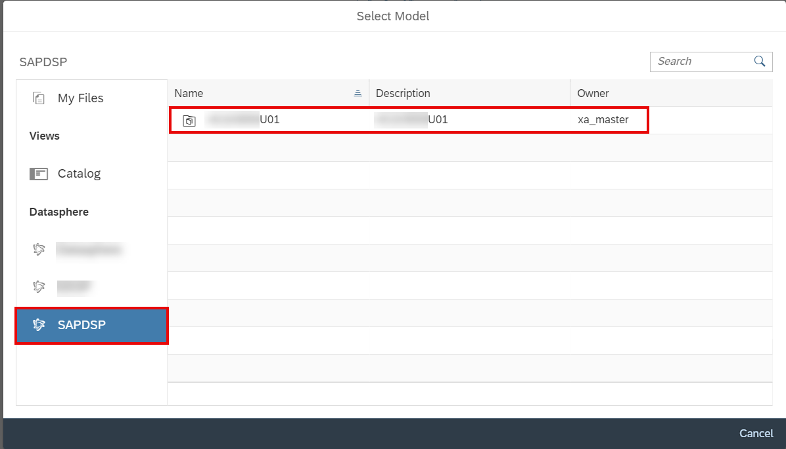
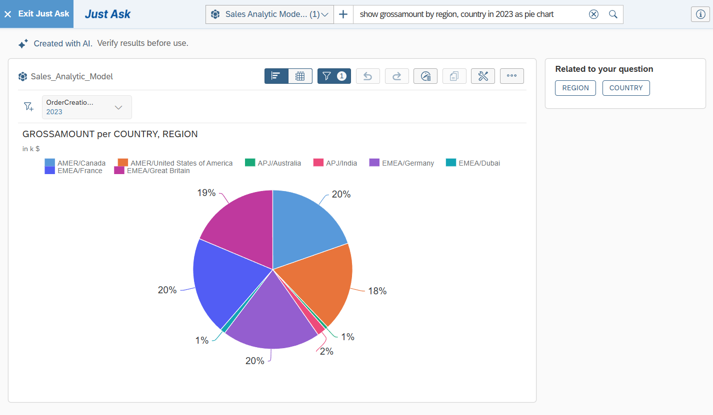

# 29. Just Ask (AI 자연어 질의)

**소요 시간:** 약 10분

## 학습 목표

**Just Ask** 기능을 활용하여 자연어로 데이터를 검색하고 결과를 탐색합니다.

## 주요 내용

**Just Ask**는 AI 기반 자연어 질의(NLQ) 기능입니다. 일상적인 영어로 질문을 입력하면 차트와 테이블 형태로 즉시 답변을 제공합니다. SAP Analytics Cloud 데이터 모델과 SAP Datasphere 모델을 모두 지원합니다.

### 사전 요건

다음 중 하나가 완료되어 있어야 합니다:
- **Analytic Modeling** 단원에서 Sales Analytic Model 직접 생성
- **Import Analytic Model** 선택 단원에서 템플릿 임포트

### 단계별 실습

**Just Ask 실행**
1. 사이드 네비게이션 패널에서 **Home** 선택
   - 이전 단원에서 열려 있는 Story가 있으면 저장 후 닫기
2. 메인 툴바에서 **Just Ask** 아이콘 선택
3. 환영 메시지 팝업 확인

**데이터 검색 (Search for Data)**
- 모델 선택 후 **Ask a question** 입력 필드에 질문 입력
- 예: "Show gross sales by year", "Top 5 business partners by sales"
- 질문에 따라 차트 또는 테이블 형태로 결과 표시
- 결과를 세부 조정하거나 다른 시각화 유형으로 변경 가능

**Data Analyzer에서 결과 탐색**
- Just Ask 결과를 **Data Analyzer** 도구로 연결하여 더 심층적인 분석 수행

> 💡 SAP Help Portal의 **Just Ask** 문서를 참조하세요.

