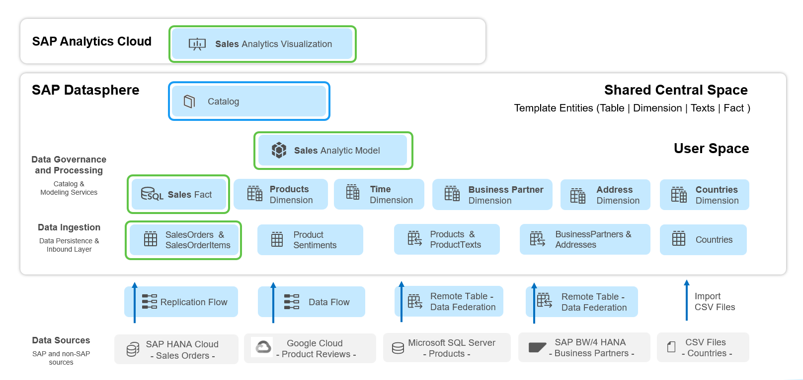
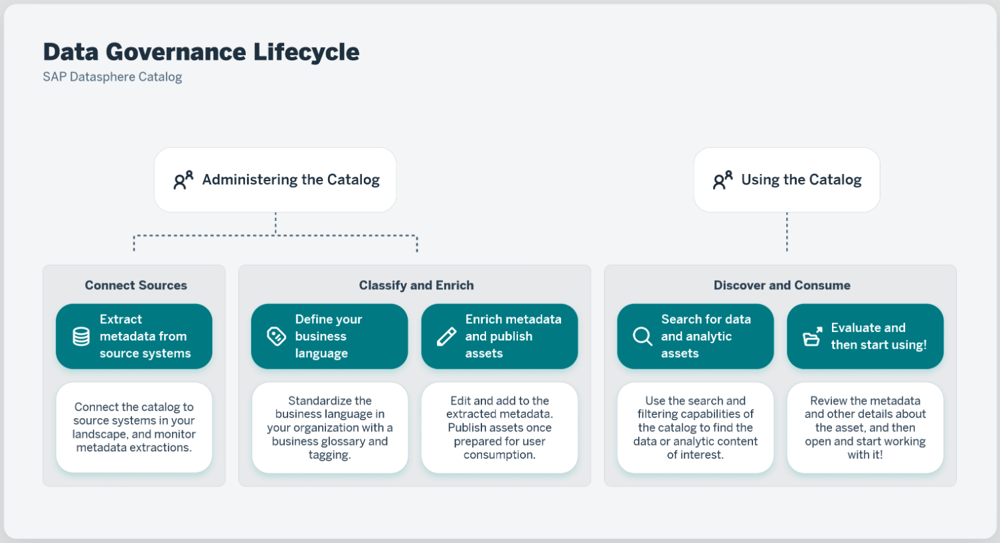

# 30. Catalog 소개 (Introduction)

**소요 시간:** 약 5분

## 학습 목표

SAP Datasphere **Catalog**의 개념과 활용 방법을 이해합니다.

## 주요 내용

**SAP Datasphere Catalog**는 전사적으로 분산된 데이터 및 분석 자산을 **발견(Discover)**, **보강(Enrich)**, **분류(Classify)**, **게시(Publish)** 할 수 있는 중앙 허브입니다.

### Catalog의 핵심 역할

- 모든 데이터 소스에 대한 완전하고 연결된 뷰 제공
- 데이터 거버넌스 표준 및 프로세스 수립·적용
- 사용자에게 신뢰할 수 있는 셀프서비스 데이터 탐색 환경 제공
- **Data Marketplace**의 Data Products 및 Data Providers 목록 포함

### 이 단원에서 학습할 내용

- Catalog 내비게이션 방법
- 게시된 자산(Asset) 탐색
- Glossary Terms, KPI, Tag와의 연계 관계
- Impact and Lineage 분석 다이어그램

> 💡 이 단원에서 탐색할 자산은 이전 단원에서 생성한 오브젝트의 사본으로, 이미 보강(Enrich) 및 게시(Publish) 처리되어 있습니다.
>
> SAP Help Portal의 **Catalog Concepts** 문서를 참조하세요.
