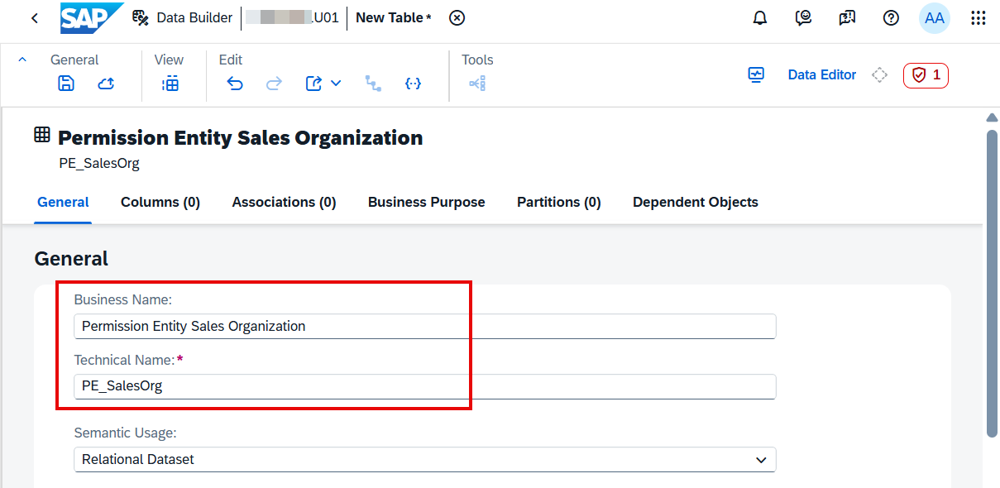
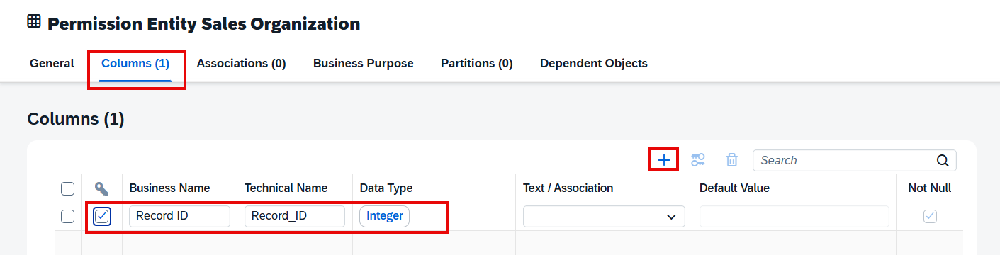
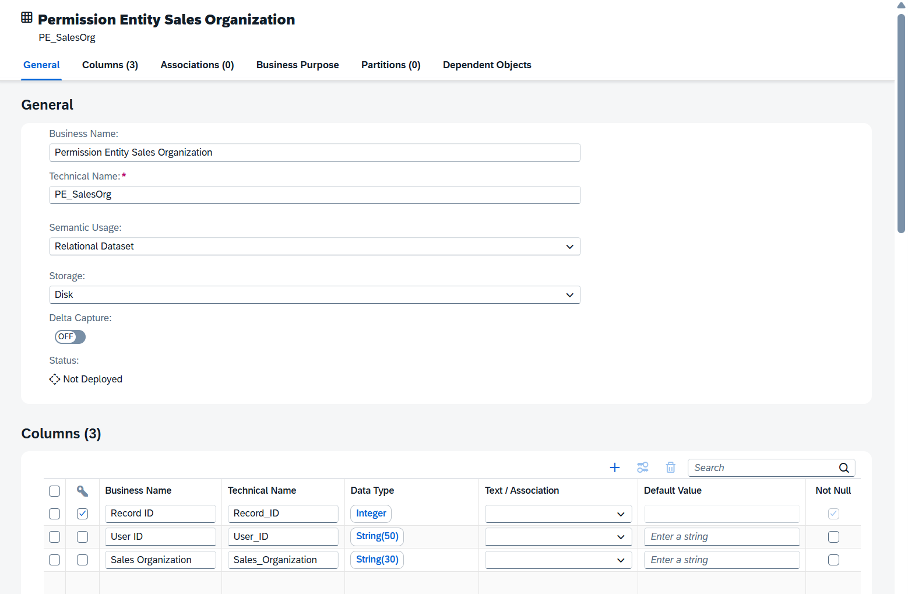
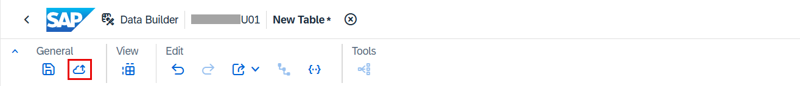
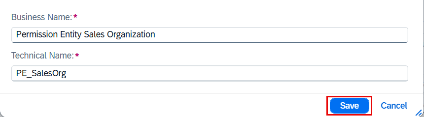
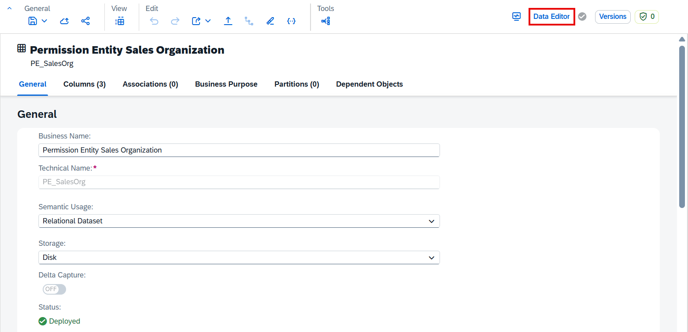
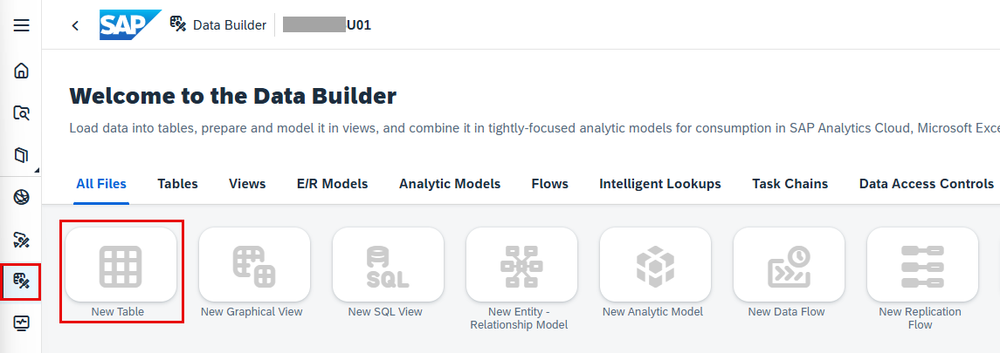

# 34. Data Access Control (행 수준 보안)

**소요 시간:** 약 15분

## 학습 목표

Data Access Control을 통한 행 수준 보안(Row-Level Security) 개념을 이해하고, 권한 엔티티와 접근 제어 요소를 정의하여 Sales Fact View에 연결합니다.

## 주요 내용

**Data Access Control**은 오브젝트에 행 수준 보안을 적용하는 기능입니다. 적용된 오브젝트를 직접 조회하거나 소스로 사용하는 모든 사용자는 지정된 기준에 따라 권한이 있는 레코드만 볼 수 있습니다.

### 접근 기준(Criteria) 유형

- **Single Values**: 사용자가 권한을 가진 단일 값과 일치하는 레코드만 조회 가능
- **Operator and Values**: AND/OR 복합 조건을 포함한 연산자-값 쌍 기준으로 레코드 접근 제어
- **Hierarchy**: 권한이 있는 계층 값 및 모든 하위 노드에 해당하는 레코드만 조회 가능

### 단계별 실습

**1단계: Permission Entity(권한 테이블) 생성**
1. **Data Builder** → 내 스페이스 선택
2. **New Table** 타일 선택
3. 테이블 정보 입력 (Business Name, Technical Name 등)
4. 컬럼 추가: 사용자 ID 컬럼 및 판매 지역 기준 컬럼 정의
5. 본인 사용자 ID와 특정 판매 지역 값을 데이터 레코드로 삽입
6. **Deploy** 후 저장

**2단계: Data Access Control Entity 생성**
- **Data Access Control** 오브젝트 생성
- Criteria 유형: **Single Values** 선택
- 앞서 생성한 Permission Entity를 연결하고 기준 컬럼 매핑

**3단계: Fact View에 Data Access Control 연결**
- Sales Fact View를 열고 **Data Access Control** 섹션에서 앞서 만든 엔티티 연결
- **Deploy** 후 저장

**4단계 (선택): JSON 템플릿 업로드**
- 사전 구성된 JSON 템플릿 파일로 오브젝트 임포트 가능

**5단계: 제한된 레코드 미리 보기**
- Fact View 미리 보기에서 본인 사용자 ID 기준으로 필터링된 레코드만 표시되는지 확인

> 💡 SAP Help Portal의 **Securing Data with Data Access Controls** 문서를 참조하세요.
