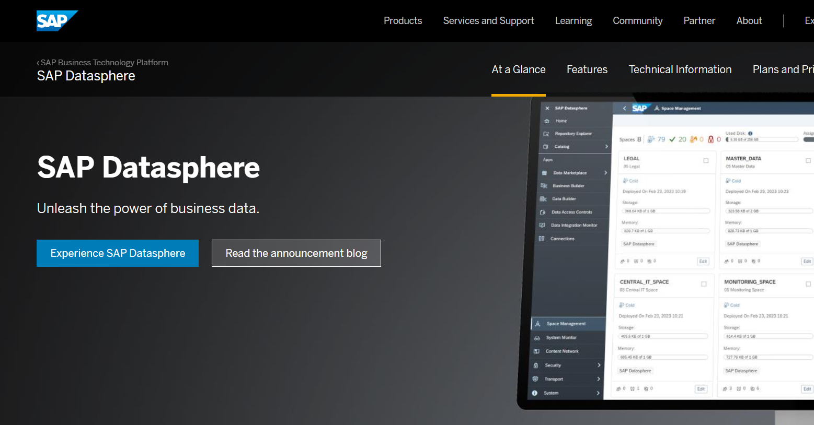
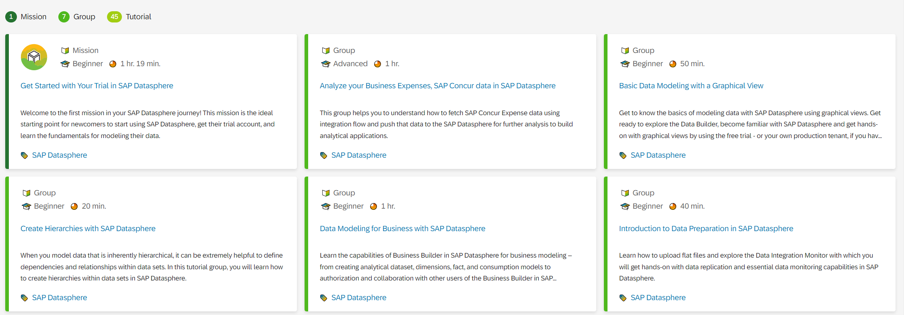
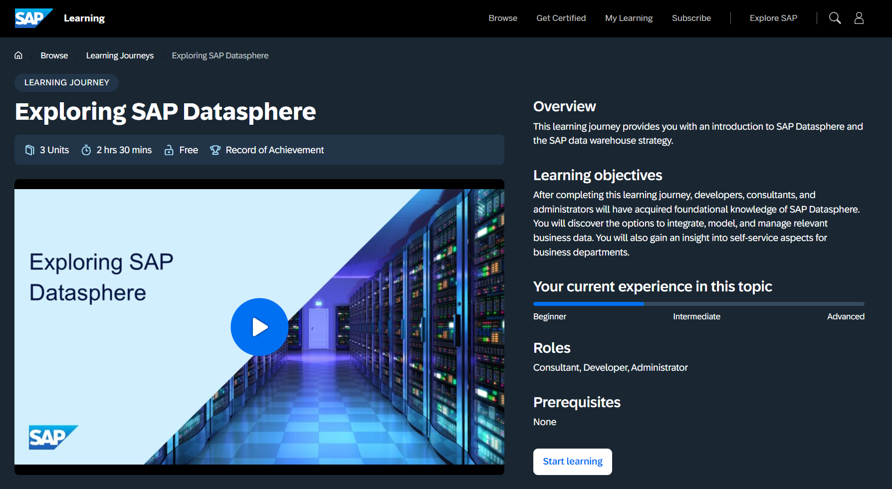

# 35. 제품 정보 및 추가 학습 자료 (Product Information and Learnings)

**소요 시간:** 자유

## 학습 목표

SAP Datasphere 제품 및 관련 학습 자료에 대한 추가 정보를 안내합니다.

## 주요 내용

SAP Datasphere에 대해 더 깊이 학습할 수 있는 외부 링크와 커뮤니티 자료를 소개합니다.

### SAP Datasphere 공식 랜딩 사이트

- **[Landing Page](https://www.sap.com/products/technology-platform/datasphere.html)**: SAP Datasphere의 주요 기능과 최신 정보를 확인할 수 있는 공식 출발점
- **SAP Tutorials for Developers**: 개발자를 위한 셀프스터디 단원 모음

### Learning Journey (학습 여정)

- **Exploring SAP Datasphere**: SAP Datasphere 입문 및 SAP 데이터 웨어하우스 전략 소개 공식 학습 여정

### SAP Learning Community 참여

- **SAP Learning Group**: SAP 학습 전문가(SME)가 운영하는 공식 학습 커뮤니티
  - 학습 여정 관련 질문 및 답변
  - 자격증 취득 준비 지원
  - 학습 목표 달성 지원

> 🎉 **SAP Datasphere Overview 학습 과정을 모두 완료했습니다!**
> 본 과정에서는 데이터 수집(Replication Flow, Data Flow, Remote Table, Local Table), 데이터 모델링(Dimension View, Fact View), 분석 모델링(Analytic Model), SAP Analytics Cloud 리포팅, Catalog 탐색, Open SQL Schema, Data Access Control까지 SAP Datasphere의 핵심 기능 전반을 다루었습니다.
